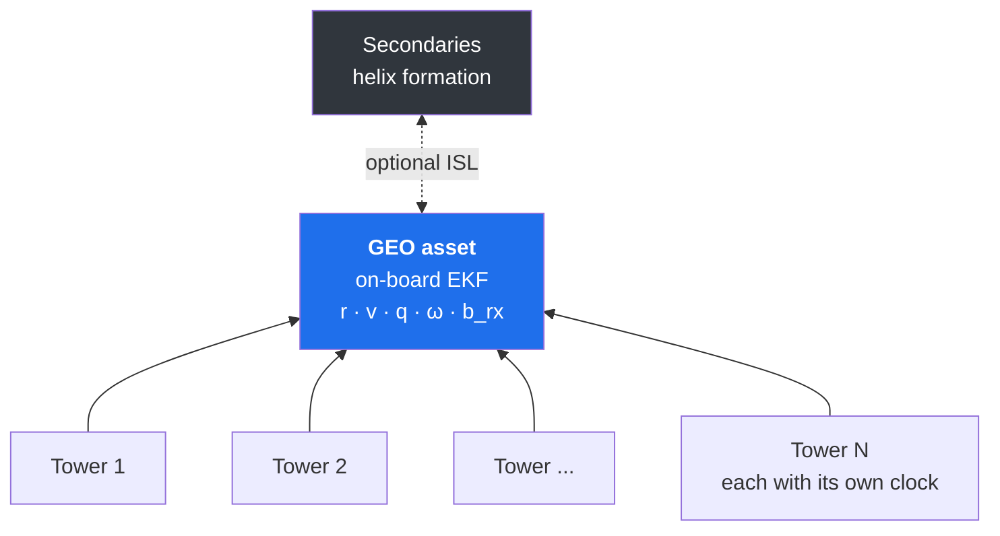
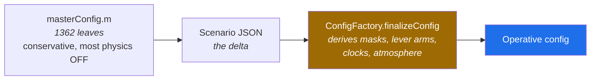

# oo_v1 — Reverse-GNSS EKF Simulation

**Ground towers transmit GNSS-like ranging signals *up* to a spacecraft, which navigates itself.**

An object-oriented MATLAB simulation of the reverse-GNSS link: several ground towers, each with its
own clock, transmit to one or more space assets, and each asset estimates its position, velocity,
attitude, angular rate and receiver-clock state on board with an Extended Kalman Filter.

*Individual Research Project — Cranfield University · MATLAB R2025b*



---

## Contents

| | |
|---|---|
| [Quick start](#quick-start) | run your first scenario |
| [The one thing to understand first](#the-one-thing-to-understand-first) | configuration layering |
| [Scenarios](#scenarios) | the 172-file experiment ladder |
| [Configuration editor](#configuration-editor) | build a run without reading all 1362 knobs |
| [Architecture](#architecture) | where the code lives |
| [What it measures](#what-it-measures) | observables, state vector, sign conventions |
| [Output](#output) | what a run writes |
| [Testing](#testing) | the regression gate and unit suite |
| [Results and limits](#results-and-limits) | what is and is not claimed |
| **[Scientific Validation Manual](docs/VALIDATION_MANUAL.md)** | **the full term-by-term physics audit** |

---

## Quick start

```matlab
cd oo_v1
run_oo_v1                                        % default.json, 3600 s
run_oo_v1('golden_baseline.json')                % THE reference scenario
run_oo_v1('scene008_G5S1R4_TW1_golden.json')     % one ladder rung
run_oo_v1('isl004_sigma0p050golden.json', 7200)  % same file, 2 h arc
```

Three rules that the whole design rests on:

1. **`run_oo_v1.m` is a thin runner with no physics of its own.** Change a run by editing
   `config/masterConfig.m` or by picking a scenario JSON — never by editing the runner.
2. **Duration is the runner's second argument** (default 3600 s). No scenario file sets
   `simulation.duration_s`, so one file can be swept over arc lengths without being edited.
3. **Scenario files are found by name alone**, wherever they live in `config/`.

---

## The one thing to understand first

> [!IMPORTANT]
> **`masterConfig`'s bare defaults are not the reference scenario.**



| | `run_oo_v1` no arguments | `golden_baseline.json` |
|---|---|---|
| Resolves | `default.json` — sets only the scenario name | 174 explicit leaves |
| Towers × antennas | 5 × 1 | 5 × 4 |
| Realistic atmosphere | off | **on** |
| Elevation mask | 5° | **10°** |
| Multipath, scintillation, higher-order iono | off | **on** |
| Purpose | a bare, cheap, conservative run | **the defensible reference** |

**154 of the 172 ladder scenarios resolve to a golden baseline** through the `"_extends"` chain
(102 → `golden_baseline.json`, 32 → `_multi`, 20 → `_attitude`; the other 18 root at test
fixtures). The golden settings — not the bare `masterConfig` values — are what nearly every result
actually ran with.
Every numeric value in `golden_baseline.json` has a citation in
[`docs/golden_baseline_provenance.md`](docs/golden_baseline_provenance.md).

Two consequences worth internalising:

- **The literal `masterConfig` is not the whole story.** `finalizeConfig` derives a great deal
  before the run starts, so every run writes its fully-resolved config **plus** a
  literal-vs-resolved override list into a plain-text `.out`. A run is self-describing without
  MATLAB.
- **`_extends` inheritance is not ownership.** A scenario whose "delta" already matches the base
  changes nothing. Measured: 29 of 108 rungs in one sweep were dead (≈ 27 %). Always diff the
  *resolved* config.

### Run knobs — the ones you actually reach for

All at the top of `config/masterConfig.m`. Defaults below are `masterConfig`'s own, **not** the
golden baseline's (see the table above).

| Knob | Meaning | Default |
|---|---|---|
| `cfg.scenario.nTowers` | ground transmitters. **30 real sites are defined**; `nTowers` selects a prefix | `5` |
| `cfg.scenario.nSpaceAssets` | 1 = ground-only; >1 = helix ISL swarm aiding the primary | `1` |
| `cfg.scenario.nReceivers` | receive antennas. 1 is enough for the nominal star-tracker attitude; 4 is the GNSS lever-arm experiment | `1` |
| `cfg.scenario.orbitClass` | `'GEO'` \| `'MEO'` \| `'LEO'` (GEO is a strict no-op) | `'GEO'` |
| `cfg.simulation.duration_s` | **overridden by `run_oo_v1`'s second argument** — this value only applies to direct `resolveSimulationConfig` callers | `14400`; runner uses `3600` |
| `cfg.asset.clockType` | `'CESIUM1'` \| `'RUBIDIUM'` \| `'OCXO'` \| `'TCXO'` | `'CESIUM1'` |
| `cfg.clock.receiver.deterministic` | `false` = the space oscillator actually runs | `false` |
| `cfg.clock.tower.deterministic` | `false` = the ground oscillators actually run | `false` |
| `cfg.atmosphere.realistic` | realistic troposphere/ionosphere overlay | `false` (golden: **true**) |
| `cfg.estimator.elevationMask_rad` | visibility cut-off | `5°` (golden: **10°**) |
| `cfg.estimator.attitude.primaryMode` | `'starTrackerGyroscope'` is the nominal attitude solution | `'starTrackerGyroscope'` |
| `cfg.measurements.twoWayTimeTransfer.enable` | the tower↔spacecraft two-way clock row | `false` |
| `cfg.physics.relativity.clock.enable` | gated relativistic clock-rate offset (truth side) | `false` |
| `cfg.atmosphere.sharedAcrossFormation.enable` | one per-tower air column for the whole swarm | `false` |

> [!CAUTION]
> **`sharedAcrossFormation` is off by default, which means each asset draws its own independent
> atmosphere.** Harmless for a single asset, **wrong for a formation**: two satellites 2 km apart at
> GEO see one tower through ray paths diverging by 11 arcsec — far inside the decorrelation scale of
> either layer, so the delay is physically common-mode. Turn it on for **any between-satellite
> differenced ground observable**, or the difference carries metres of independent tropo/iono
> instead of the millimetres the geometry justifies. It shares the atmosphere only; receiver noise,
> clocks, multipath and hardware stay per-asset, unlike the blunt
> `cfg.rng.independentStreams.enable = false`.

---

## Scenarios

One JSON is overlaid on `masterConfig` per run.

| Folder | Prefix | Files | What it varies |
|---|---|---:|---|
| `config/` | — | 5 | `golden_baseline*`, `default.json`, `realism.json` |
| `config/ladder/scene/` | `scene###` | 21 | formation and ground-network topology (G5 / G12 / G30, TW0 / TW1) |
| `config/ladder/feat/` | `feat###` | 26 | one physical feature toggled per file |
| `config/ladder/carr/` | `carr###` | 23 | carrier processing and ambiguity strategy |
| `config/ladder/best/` | `best###` | 22 | the best-of stack — do the levers compound? |
| `config/ladder/att/` | `att###` | 20 | attitude determination variants |
| `config/ladder/ISL/` | `isl###` | 18 | crosslink sigma, configuration, frequency |
| `config/ladder/clock/` | `clk###` | 16 | oscillator class, space and ground segments |
| `config/ladder/freq/` | `freq###` | 14 | L1 / L2 / L5 raw and ionosphere-free |
| `config/ladder/test/` | `test###` | 9 | fixtures owned by the test suite |
| `config/ladder/prod/` | `prod###` | 3 | broadcast product cadence and quality |
| `config/personal/` | — | — | your own scenarios, untracked |

A ladder file inherits through `"_extends": "golden_baseline.json"` and carries **only its delta**,
so the file shows exactly what it changes, and a golden edit propagates to every rung sitting on
it. Reports are labelled by file prefix: `Report_scene008_ts3600_G5S1R4_TW1`.

---

## Configuration editor

**Build a scenario without reading `masterConfig`.** Its 1362 leaves are not a list anyone can
work through, and a hand-written scenario JSON fails in a way that looks like success. A knob the
resolution derives accepts your value at merge time, discards it before the run, and the report
prints the setting as active.

`tools/config_editor/` generates a **standalone HTML page** that knows which leaves are live and
which are derived. No server, no network, no MATLAB in the loop. Open it by double-clicking.

```bash
matlab -batch "addpath('tools/config_editor'); buildConfigEditor"
```

Pick a base scenario, open the sections you care about, then save a delta into `config/personal/`.
Every knob shows `masterConfig`'s own prose, the value it inherits and which file that came from,
the legal values where `configEnumRegistry` defines a checked set, and a **refusal** where the
path is derived and a scenario cannot own it. Pair members of the twelve master effect toggles
carry their own warning, which is the mistake that once left six shipped ladder rungs disabling
nothing at all.

Three detail levels, and the split between them is measured rather than chosen. The effect
toggles plus the 70 most-set knobs, then the 379 any shipped scenario sets, then all 1362.

Then check it before running, because the page cannot see what `finalizeConfig` derives.

```matlab
checkPersonalConfig('myRun.json')   % names any leaf that did not survive resolution
run_oo_v1('myRun.json', 3600)
```

Re-run `buildConfigEditor` after editing `masterConfig`. `tests/test_config_editor_schema.m` fails
when the generated page and the working tree have parted.

> [!TIP]
> **The full instructions are in [`docs/CONFIG_EDITOR_MANUAL.md`](docs/CONFIG_EDITOR_MANUAL.md).**
> Every control on the page, the four warnings it raises, the twelve master toggles and the
> truth/model pair mistake they prevent, what `checkPersonalConfig` tells you that the page
> cannot, and how the staleness gate works.

---

## Architecture

737 MATLAB files, ~173 000 lines.

```
run_oo_v1.m              THE entry point — thin runner, no physics
config/
  masterConfig.m         THE run config (structural defaults inlined at the bottom)
  internal/              enable expansion, overlays, contract check, enum registry
  ladder/                the 172-file experiment ladder
+revgnss/   (241 files)  orchestration, reporting, carrier/ISL/attitude machinery
  ConfigFactory.m          finalizeConfig / presets / clock templates / atmosphere
  ScenarioFactory.m        instantiates assets, towers, EKF, measurement + error models
  ReverseGNSSSimulation.m  the orchestrator: truth → measure → predict → update
  ReportRunner.m           single-run driver
  ClockExactReportBuilder.m the production LaTeX report builder
  MonteCarloConsistency.m  ensemble NEES/NIS chi-square harness
  ImperfectionAudit.m      honesty predicates (matched vs genuinely uncalibrated)
  +integer/                LAMBDA, decorrelated bootstrap, ISL double difference
  +report/                 report section builders
+filter/    (2 files)    ReverseGNSSEKF.m — Joseph update, MEKF attitude reset
                         EkfDynamicsPredictor.m — state propagation + F/Q
+models/    (40 files)
  +atmosphere/             Saastamoinen, Niell, Klobuchar, gaseous absorption
  +clocks/                 IEEE-1139 power-law oscillator, tower product, relativistic
  +corrections/            Sagnac, Shapiro, antenna PCO/PCV
  +errors/                 error chain, environment, higher-order iono, phase wind-up
  +frames/                 frame/time utils, light-time solver, solid-Earth tide, EOP
  +measurements/           code / carrier / Doppler builders and Jacobians
  +noise/                  identity-keyed RNG registry, stochastic processes
  +orbit/                  J2 dynamics, propagator, perturbations, DE440
  +sensors/                IMU, gyroscope, star tracker
+data/      (1 file)     SimulationDataStore.m — flat per-epoch diagnostics store
tests/      (364 tests)  unit suite + tests/regression/ frozen-golden gate
analysis/                ladder reporting and cross-run analysis
tools/                   config_editor and friends
docs/                    VALIDATION_MANUAL.md and the design/audit record
```

---

## What it measures

### Topology and sign conventions

Reverse GNSS is, in clock and estimation topology, **identical to forward GPS**: many transmitters
each with its own clock, one receiver clock per asset. The "reverse" is purely geometric.

```
z_i = rho_i + b_rx - b_tower_i + (atmosphere, corrections, noise)
```

| Quantity | Jacobian |
|---|---|
| Line of sight | `+u` (tower → spacecraft unit vector) |
| Receiver clock | `+1` (every row) |
| Tower clock | `-1` (its own row) |
| Troposphere | `+` on code, `+` on carrier |
| **Ionosphere** | **`+` on code, `-` on carrier** |

### State vector

Base dimension **14**: `r(3) v(3) euler(3) omega(3) b_rx bdot_rx`, augmented per run with carrier
float ambiguities (tower × receiver × signal), per-tower ZWD, per-tower slant ionosphere, gyro
bias, an SRP scale coefficient, and 2 states per tower when tower clocks are estimated.

```
antenna phase centre : r_ant = r_cm + C_ecef_body(euler) * leverArm_body
truth pseudorange    : z_i = ||r_ant_true - r_tower_i|| + b_rx - b_tower_i
                           + trop + iono + hardware + multipath + noise
model pseudorange    : h_i = ||r_ant_est - r_tower_i|| + b_rx_est - b_tower_product_i
                           + trop_model + iono_model
```

The lever arm is the **only** path by which attitude enters the ranging observables.

### The truth–estimation firewall

`z` is built only from truth; `h`, `H` and `R` only from the estimator state and model-side
corrections. **The estimator contains no random-number generation at all**, and the "use the truth
as the model" oracle does not merely default off — it **throws**. Every accuracy claim rests on
this. See [Manual §2.3](docs/VALIDATION_MANUAL.md#23-the-truthestimation-firewall).

---

## Output

```
output/Report_YYYYMMDD/Report_v###_G#S#R#_TW#/Report_v###_ts#_G#S#R#_TW#.{pdf,mat,out,tex}
  v###  = cfg.report.runVersion
  ts#   = duration in seconds
  G/S/R = ground towers / space assets / receivers
  TW#   = two-way time transfer on (1) or off (0)
```

The **`.out` is a MATLAB-free run log**: final metrics, output paths, the full *resolved* config,
and the literal-vs-resolved override list showing exactly what `finalizeConfig` changed.

Ladder runs group every rung under one folder, with a combined `Ladder_{description}.txt` summary.

> [!NOTE]
> **Reading the metrics.** Reported NIS is **raw, not per-dof** — its expectation is rows per epoch
> (105 for the golden 4-antenna run), not 1. Every history row is **post-update**. And "converged"
> has three incompatible definitions across the metrics: `finalPositionRMS_m` is the last **20
> epochs**. Do not compare tail metrics to each other.

---

## Testing

**Frozen-golden gate** — certifies the scientific numbers never move under refactoring:

```matlab
tests/regression/run_oo_v1_regression('smoke')              % 120 s single-antenna
tests/regression/run_oo_v1_regression('full')               % 14400 s single-antenna
tests/regression/run_oo_v1_regression('smoke','headline')   % 4-antenna headline
```

The gate re-runs the frozen scenario and fails if any **core** scientific metric moves beyond FP
tolerance; non-core diagnostic changes only warn. **Never weaken it** — deliberate physical changes
are handled by re-freezing the affected reference with the diff attributed to its cause.

**Unit suite:**

```matlab
cd oo_v1; addpath('tests'); run_all_tests    % fast set; run_all_tests('all') for everything
```

> [!CAUTION]
> **`addpath(genpath('.'))` can test the wrong tree.** A leftover git worktree under
> `.claude/worktrees/` once made MATLAB resolve both `masterConfig` and `run_all_tests` to a stale
> copy — the suite silently tested the worktree and would have gone green while testing nothing.
> Also: tests share one MATLAB session via `evalin('base')`, so **a FAIL line is not evidence on
> its own** — reproduce it in isolation.

**Monte-Carlo consistency** — `revgnss.MonteCarloConsistency.run` pools per-epoch NEES/NIS across a
seeded ensemble and band-checks against a two-sided chi-square interval. Off by default. It is
synthetic consistency evidence, not real-world proof, and it reports the filter as conservative
rather than tuning it into the band.

---

## Results and limits

### The headline finding

> [!WARNING]
> **The dominant result is a geometry limit, not a coding error.**
>
> On a one-way, sparse-ground GEO the radial position and the receiver clock appear in nearly the
> same common-mode combination in every pseudorange — correlation **−1.000** at G12, and present at
> G5 too. A decimetre of code noise maps to metres of radial error and hundreds of nanoseconds of
> clock error.
>
> **No reweighting of `R` or `Q` cures it.** Estimating the tower clocks makes it worse.

| Route out | Measured effect |
|---|---|
| Two-way time transfer | a clock row with **no position column** → tens of ps |
| Co-observed ISL swarm | supplies the missing geometry → ~3 cm / ~50 ps |
| Wider ground network | 12 towers attack it; **30 towers buy only ~24 % tail RMS for 6× the rows** |
| Best-of stack | levers **compound** — 6.8× single-asset tail, 6.0× multi-asset |
| Re-tuning `R` or `Q` | nothing |

### Not claimed

- The sub-100 ps / sub-metre regime is reached by the **enhanced** (two-way or swarm)
  configurations, **not** by the plain one-way uplink.
- No integer fixing on the long tower→spacecraft carrier. LAMBDA exists and works on the short
  antenna baselines and the ISL double difference; the undifferenced float ambiguity on the long
  link is exactly unobservable.
- Higher-order ionosphere is applied to the **code only, never the carrier**.
- Inter-frequency DCB is **inert** on the active path (hardware delay is emitted non-dispersively).
- No calibrated products of any kind — no ANTEX / IONEX / SP3 / CLK / RINEX ingestion. Every error
  model is synthetic, though physically sized.
- Frames are not IERS/EOP grade; geopotential stops at J2; drag is not modelled, which makes the
  exposed **LEO orbit class non-physical**.
- No arc-length trend survives four points (1 / 2 / 6 / 12 h): the spread is clock-draw scatter.

### What to expect from convergence

Pseudorange from N towers primarily observes position (3) and receiver clock (1). With few
measurements and many states the EKF is per-epoch underdetermined but converges recursively.
Common-mode delays are partly absorbed by the receiver-clock state — physically correct, so
atmosphere modelling improves innovation RMS more than position. Position and clock converge first,
typically within 600–1800 s.

---

## Documentation

| Document | What it covers |
|---|---|
| **[docs/VALIDATION_MANUAL.md](docs/VALIDATION_MANUAL.md)** | **The full scientific audit** — every error model term by term, where it enters `z` / `h` / `R` / the state, the double-count check, and the test that verifies it |
| **[docs/CONFIG_EDITOR_MANUAL.md](docs/CONFIG_EDITOR_MANUAL.md)** | **How to build a scenario** — the config editor page control by control, the warnings it raises, the master toggles, and `checkPersonalConfig` |
| [docs/golden_baseline_provenance.md](docs/golden_baseline_provenance.md) | A citation for every numeric value in `golden_baseline.json` |
| [docs/ERROR_BUDGET.md](docs/ERROR_BUDGET.md) | The error budget breakdown |
| [docs/equipment_fit_realism_grade.md](docs/equipment_fit_realism_grade.md) | What real hardware meets the derived requirements |

---

<div align="center">

*A proof of concept whose scientific value lies in its honesty:*
*the estimator never sees the answer, and the result is reported as it comes out.*

</div>
