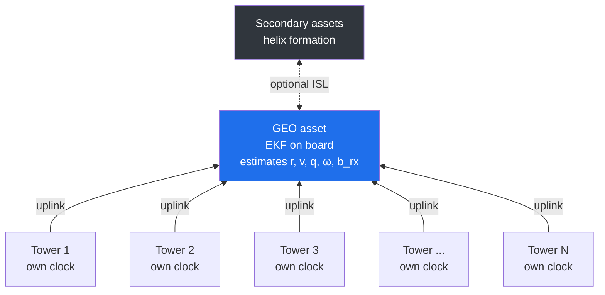
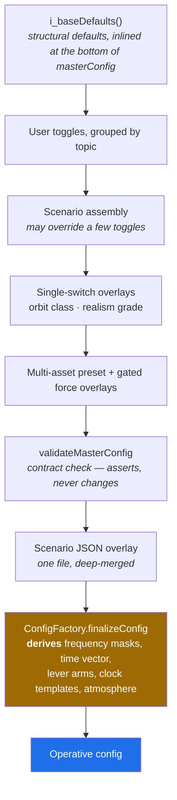
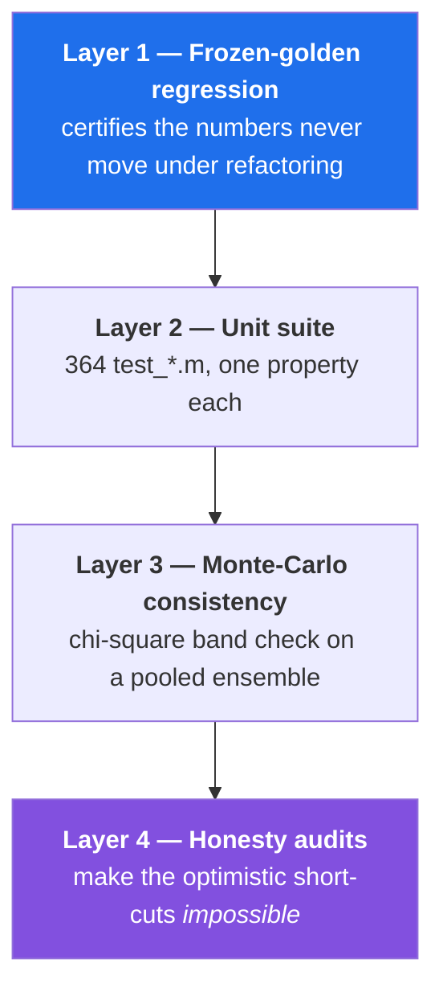

# Scientific Validation Manual — `oo_v1` Reverse-GNSS EKF Simulation

> A term-by-term audit of the error models, physical corrections and estimator behind the
> ground-to-GEO reverse-GNSS simulation.
> **Individual Research Project — Cranfield University** · MATLAB R2025b

| | |
|---|---|
| **Code base** | `oo_v1/` — 737 MATLAB files, ~173 000 lines · 364 unit tests · 172 ladder scenarios |
| **Audited against** | working tree at `feature/ground-orientation-exec`, 22 August 2026 |
| **Method** | claims read from **executable logic**, not from code comments |
| **Supersedes** | `docs/oo_v1_Validation_Manual.docx` (23 July 2026) |

---

## What this document is

This is both a **manual** and a **validation record**. For every physical error source and
scientific feature the simulation models, it states:

1. **What the effect is** and why it matters for a ground-to-space ranging link.
2. **The exact mathematical form** the code evaluates.
3. **Where it is wired** — into the truth measurement $z$, the filter model $h$, the noise
   covariance $R$, or an estimator state.
4. **Whether it could be applied twice** by accident (the double-count audit).
5. **How it is validated** — the named test that asserts it.

The audit is deliberately critical of the code comments. Comments in a research code base drift
out of date as the physics is refactored, so every statement here is taken from the equations
actually evaluated, the configuration values actually resolved, and the tests actually asserted.
Where a comment contradicts the logic, **the logic is reported**.

> [!IMPORTANT]
> **This revision corrects seven claims that the July 2026 document got wrong or that the code
> has since overtaken.** They are listed in [§21 Changes since the previous revision](#21-changes-since-the-previous-revision).
> The most consequential: the truth receiver clock is no longer noiseless, the relativistic
> clock offset is *not* harmlessly absorbed, and attitude is no longer carrier-driven by default.

### How to read it

| If you want… | Go to |
|---|---|
| The concept and the headline result | [§1](#1-the-concept-and-the-headline-result) |
| How a run actually executes | [§2](#2-how-a-run-works) |
| **The complete effect inventory in one table** | [§3](#3-the-effect-inventory) |
| A specific error model | [§4](#4-signal-propagation-and-relativistic-corrections)–[§17](#17-inter-satellite-links-and-two-way-time-transfer) |
| How the code proves itself | [§19](#19-verification-and-validation-machinery) |
| What is **not** claimed | [§20.4](#204-missing-or-not-yet-finished) |

File references are given as `path · method` rather than `path:line`, because line numbers drift
between refactors and every reference here was re-checked to resolve in the current tree.

---

## Contents

**Orientation**
- [1. The concept and the headline result](#1-the-concept-and-the-headline-result)
- [2. How a run works](#2-how-a-run-works)
- [3. The effect inventory](#3-the-effect-inventory) ← *the compressed reference*

**The physics, term by term**
- [4. Signal propagation and relativistic corrections](#4-signal-propagation-and-relativistic-corrections)
- [5. Reference frames and the Earth model](#5-reference-frames-and-the-earth-model)
- [6. Tropospheric delay](#6-tropospheric-delay)
- [7. Ionospheric delay](#7-ionospheric-delay)
- [8. Receiver clock and oscillator noise](#8-receiver-clock-and-oscillator-noise)
- [9. Tower clocks and the broadcast correction product](#9-tower-clocks-and-the-broadcast-correction-product)

**The observables**
- [10. Code pseudorange](#10-code-pseudorange)
- [11. Carrier phase and ambiguity resolution](#11-carrier-phase-and-ambiguity-resolution)
- [12. Doppler and range-rate](#12-doppler-and-range-rate)
- [13. Site and antenna errors](#13-site-and-antenna-errors)

**The estimator**
- [14. Orbit dynamics and force model](#14-orbit-dynamics-and-force-model)
- [15. The Extended Kalman Filter](#15-the-extended-kalman-filter)
- [16. Attitude determination and inertial aiding](#16-attitude-determination-and-inertial-aiding)
- [17. Inter-satellite links and two-way time transfer](#17-inter-satellite-links-and-two-way-time-transfer)
- [18. Stochastic processes and the RNG architecture](#18-stochastic-processes-and-the-rng-architecture)

**Evidence and honesty**
- [19. Verification and validation machinery](#19-verification-and-validation-machinery)
- [20. Discussion](#20-discussion)
- [21. Changes since the previous revision](#21-changes-since-the-previous-revision)
- [22. References](#22-references)

---

# 1. The concept and the headline result

## 1.1 Reverse GNSS

A conventional GNSS places many transmitters in orbit and a receiver on the ground. This
simulation studies the **reverse topology**: terrestrial towers at surveyed, known positions
transmit GNSS-like ranging signals *upward* to one or more space assets, and each asset estimates
its own position, velocity, attitude, angular rate and receiver-clock state on board.



In estimation and clock topology this is **identical to forward GNSS** — many transmitter clocks
and one common receiver clock per asset. The "reverse" is purely geometric, and that geometry
changes the elevation distribution, the direction of the atmospheric path, the Sagnac and
light-time bookkeeping, and — decisively — the observability of the radial position component
(Kaplan & Hegarty, 2006; Misra & Enge, 2011).

The fundamental observation equation, in metres:

$$z_i \;=\; \rho_i \;+\; b_{\mathrm{rx}} \;-\; b_{t,i} \;+\; T_i \;+\; I_i \;+\; \varepsilon_i$$

| Term | Meaning | Jacobian sensitivity |
|---|---|---|
| $\rho_i$ | geometric range, tower $i$ → receiving antenna | $+\mathbf{u}^\top$ (tower→spacecraft unit vector) |
| $b_{\mathrm{rx}}$ | receiver-clock bias — **common to every row** | $+1$ |
| $b_{t,i}$ | tower-$i$ clock bias — **that row only** | $-1$ |
| $T_i$ | tropospheric delay | $+$ on code, $+$ on carrier |
| $I_i$ | ionospheric delay | $+$ on code, $-$ on carrier |
| $\varepsilon_i$ | deterministic corrections + stochastic noise | — |

## 1.2 The realism-over-target principle

The stated performance objective is sub-wavelength positioning and clock synchronisation of order
**100 ps**. A guiding principle of the work — and a recurring theme of this manual — is that this
objective **must not be forced**.

The simulation is a proof of concept whose scientific value lies in producing *honest* error
behaviour. If the geometry and the observables do not support 100 ps, the reported result should
show that, not be tuned to hide it. Accordingly the default configuration is deliberately
conservative, most idealising assumptions are gated **off**, and the design philosophy throughout
is "conservative rather than optimistic".

## 1.3 The headline result, stated up front

> [!WARNING]
> **The dominant scientific finding is a geometry limit, not a coding error.**
>
> On a one-way, sparse-ground GEO link the radial position and the receiver-clock bias appear in
> almost the same common-mode combination in every pseudorange. They are **nearly degenerate**:
> the radial dilution of precision runs to several hundred, so a decimetre of code noise maps to
> metres of radial error and hundreds of nanoseconds of clock error.
>
> This **observability wall** is invariant to any reweighting of $R$ or $Q$ — no covariance
> tuning cures it — and augmenting the tower clocks as states makes it *worse*, not better.

The cures are geometric, not numerical:

| Route | Mechanism | Reaches |
|---|---|---|
| **Two-way time transfer** | range cancels by reciprocity → a clock row with **no position column** | tens of ps / sub-metre radial |
| **Co-observed swarm (ISL)** | secondaries supply the missing geometry | ~3 cm / ~50 ps |
| **Wider ground network** | 5 → 12 → 30 towers weakens the degeneracy | partial; 30 towers buys only ~24 % tail RMS over 12 |
| Re-tuning $R$ or $Q$ | — | **nothing** |

This is why the manual is emphatic that the sub-100 ps objective is reached by the **enhanced**
configurations, not by the plain one-way uplink, and why forcing the one-way result toward the
target would be dishonest.

---

# 2. How a run works

## 2.1 Single entry point, one configuration file

There is exactly one run entry point, `run_oo_v1.m`, a thin runner that adds **no physics of its
own**. All run configuration lives in `config/masterConfig.m`, which is read top to bottom in a
fixed order:



> [!IMPORTANT]
> **The literal `masterConfig` is not the operative configuration.**
> `ConfigFactory.finalizeConfig` derives a great deal before the run starts. In particular
> `cfg.atmosphere.realistic = true` causes it to apply the realistic troposphere/ionosphere
> overlay, so that overlay **is active in the default run**.
>
> Every run therefore writes its fully-resolved configuration *plus* a literal-versus-resolved
> difference list into a plain-text `.out` log. The run is self-describing without MATLAB.

## 2.2 The per-epoch loop

`revgnss.ReverseGNSSSimulation` advances one epoch at a time:

```mermaid
flowchart LR
    subgraph TRUTH["TRUTH WORLD — what actually happens"]
        direction TB
        T1[1 · Propagate truth orbit + attitude<br/>step truth clocks]
        T2[2 · Step truth error processes<br/>atmosphere · multipath · scintillation<br/><i>independent RNG substreams</i>]
        T3["3 · Build measurement z<br/><i>truth geometry, truth clocks, realised errors</i>"]
        T1 --> T2 --> T3
    end
    subgraph EST["ESTIMATOR WORLD — what the filter believes"]
        direction TB
        E1["4 · Build prediction h, Jacobian H,<br/>covariance R<br/><i>estimator state + model corrections only</i>"]
        E2[5 · EKF predict → update]
        E1 --> E2
    end
    T3 -->|"z"| E2
    E2 --> D[6 · Record diagnostics]
    style TRUTH fill:#1a3a1a
    style EST fill:#1a2a4a
```



The truth propagation uses a genuinely integrated J2 Runge–Kutta trajectory (precomputed once for
efficiency, verified science-identical to per-epoch integration), and the EKF prediction uses the
**same J2 force model**, so the two agree to machine precision at the default 1 s step.

## 2.3 The truth–estimation firewall

This is the load-bearing structural assumption behind every accuracy claim in this document.

| | Truth world | Estimator world |
|---|---|---|
| **Builds** | $z$ | $h$, $H$, $R$ |
| **Reads** | true position, attitude, clocks, realised error chain | estimator state, model-side corrections, broadcast products |
| **Random numbers** | every noise source, own identity-keyed substream | **none at all** |
| **Can see the answer?** | — | **no** |

Three properties make this structural rather than conventional:

- The estimator contains **no random-number generation whatsoever** (grep-confirmed), so filter
  randomness cannot correlate with any truth stream.
- The "use the truth as the model" oracle is **not merely disabled — it throws an error** if
  requested.
- A model-family guard enforces that truth and EKF share the same dynamics family, so orbit error
  arises from realistic sources rather than a deliberate mismatch.

> A result is meaningful only because the estimator never had access to the answer. Everything
> in [§19.4](#194-honesty-audits) exists to keep it that way.

## 2.4 State vector

The EKF core state has dimension **14**:

$$\mathbf{x} = \begin{bmatrix}\mathbf{r}_{(3)} & \mathbf{v}_{(3)} & \boldsymbol{\theta}_{(3)} & \boldsymbol{\omega}_{(3)} & b_{\mathrm{rx}} & \dot{b}_{\mathrm{rx}}\end{bmatrix}^\top$$

augmented per run:

| Block | Size | Present when |
|---|---|---|
| position $\mathbf{r}$, velocity $\mathbf{v}$ | 3 + 3 | always |
| attitude error $\boldsymbol{\theta}$, body rate $\boldsymbol{\omega}$ | 3 + 3 | always (frozen if attitude not estimated) |
| receiver clock bias, drift | 1 + 1 | always |
| carrier float ambiguities | tower × receiver × signal | `ambiguityMode = 'floatPerTowerReceiverSignal'` |
| zenith wet delay | 1 per tower | `troposphereMode = 'perTowerZwd'` |
| slant ionosphere | 1 per tower | `atmosphere.estimateIono` |
| gyro bias | 3 | `estimator.imu.enable` |
| SRP scale coefficient | 1 | `estimator.srpCoefficient` |
| tower clocks | 2 per tower | `estimateTowerClocks` |

The state map that locates each block is built once (`ReverseGNSSEKF · buildStateMap_`) and is the
single source of truth for indexing — each physical quantity occupies exactly one block.

**Antenna placement.** The observation is formed at the antenna phase centre, not the centre of
mass:

$$\mathbf{r}_{\mathrm{ant}} = \mathbf{r}_{\mathrm{cm}} + \mathbf{C}(\boldsymbol{\theta})\,\mathbf{l}_{\mathrm{body}}$$

This lever arm is the **only** path by which attitude enters the ranging observables.

## 2.5 Data storage and reporting

Per-epoch diagnostics go to a flat array-backed store (`+data/SimulationDataStore.m`) under a
compact storage policy that never retains full per-epoch matrices for long runs. It preserves all
scientific summaries — state, covariance diagonal, truth-minus-estimate errors, residual
summaries, NEES/NIS scalars, measurement counts, clock summaries — while keeping the output small.

Each run produces a self-describing folder whose name encodes version, duration and topology,
containing the report PDF, the `.mat`, the plain-text `.out` and the LaTeX source. The production
report builder is `revgnss.ClockExactReportBuilder`.

---

# 3. The effect inventory

This section is the compressed reference. Every subsequent chapter expands one group of rows.

## 3.1 Two different "defaults"

> [!CAUTION]
> **`masterConfig`'s bare defaults are not the reference scenario.** This trips people up.

| | `run_oo_v1` with no arguments | `golden_baseline.json` |
|---|---|---|
| Resolves | `default.json` — sets only `scenario.name` | 174 explicit leaves |
| Towers × antennas | 5 × 1 | 5 × 4 |
| Realistic atmosphere | **off** | **on** |
| Elevation mask | 5° | **10°** |
| Multipath, scintillation, higher-order iono | off | **on** |
| Troposphere estimation | `none` | `perTowerZwd` |
| Purpose | a bare, cheap, conservative run | **the defensible reference** — every value cited in `docs/golden_baseline_provenance.md` |

**154 of the 172 ladder scenarios resolve to a golden baseline** through the `_extends` chain —
102 to `golden_baseline.json`, 32 to `golden_baseline_multi.json`, 20 to
`golden_baseline_attitude.json`. The remaining 18 root at test fixtures. So the golden settings —
not the bare `masterConfig` values — are what nearly every published result actually ran with. Throughout this manual, *"golden"* means the `golden_baseline.json` column.

## 3.2 Where each effect enters

Legend for the wiring columns: **z** = injected into the truth measurement · **h** = corrected in
the model prediction · **R** = charged into the measurement covariance · **x** = carried as an
estimator state.

### Propagation and geometry

| Effect | z | h | R | x | Golden | Source |
|---|:-:|:-:|:-:|:-:|:-:|---|
| Geometric range | ● | ● | | | on | `RangeCorrections · correctedPseudorange` |
| Sagnac (Earth rotation) | ● | ● | | | on | `RangeCorrections · sagnacCorrectionMeters` |
| Iterative light-time | ● | ● | | | on | `LightTimeSolver · solve` |
| Shapiro delay | ● | ● | | | on | `RangeCorrections · shapiroDelayMeters` |
| Relativistic clock rate | ● | ○ | | | **off** | `Relativity · clockFracFreq` |
| Earth-orientation error | ● | | | | off | `TruthEarthOrientation` |
| Solid-Earth tide | ● | | | | off | `SolidEarthTide` |

○ = model-side correction exists but is separately gated.

### Atmosphere

| Effect | z | h | R | x | Golden | Source |
|---|:-:|:-:|:-:|:-:|:-:|---|
| Zenith hydrostatic delay (Saastamoinen) | ● | ● | | | on | `EnvironmentModel · initWeatherFromTowers_` |
| Niell mapping functions | ● | ● | | | on | `NiellCoefficients`, `MappingFunctions` |
| Wet delay + Gauss–Markov fluctuation | ● | | ● | ● | on | `EnvironmentModel · getTropDelay` |
| First-order ionosphere | ● | ● | | | on | `EnvironmentModel · getIonoDelay` |
| Klobuchar broadcast correction | | ● | | | on | `Klobuchar` |
| Thin-shell obliquity | ● | ● | | | on | `MappingFunctions · ionosphere` |
| Ionosphere-free combination | ● | ● | ● | | off | `IonoFreeCombination`, `CodeIonoFreeRowBuilder` |
| Higher-order ionosphere | ● | | ● | | **on** | `HigherOrderIonosphere` |
| Amplitude scintillation | | | ● | | **on** | `EnvironmentModel · getScintillationSigma` |
| Phase scintillation | ● | | | | **on** | `EnvironmentModel · getPhaseScintRad` |

### Clocks

| Effect | z | h | R | x | Golden | Source |
|---|:-:|:-:|:-:|:-:|:-:|---|
| Receiver oscillator (power-law) | ● | | | ● | **on, stochastic** | `ClockModel` |
| Tower oscillators | ● | | | ○ | **on, stochastic** | `ClockModel` |
| Broadcast tower-clock product | | ● | ● | | on | `TowerClockCorrectionProvider` |
| Shared product error (off-diagonal block) | | | ● | | on | `ProductClockCovarianceBuilder` |
| Clock gauge (datum restoration) | | ● | | | on | `cfg.clock.gauge.mode` |

### Observables and site errors

| Effect | z | h | R | x | Golden | Source |
|---|:-:|:-:|:-:|:-:|:-:|---|
| Code thermal noise | ● | | ● | | on | `MeasurementModelUtils · codeSignalSigma` |
| Carrier thermal noise | ● | | ● | | on | `CarrierMeasurementBuilder` |
| Carrier float ambiguity | ● | ● | | ● | on | `AmbiguityStateRegistry` |
| Cycle slips | ● | | | ● | off | `CycleSlipDetector`, `CarrierTrackManager` |
| Integer ambiguity resolution (LAMBDA) | | ● | | ● | off | `+revgnss/+integer/LambdaResolver` |
| Phase wind-up | ● | ○ | | | off | `PhaseWindup` |
| Inter-antenna carrier bias | ● | | | | off | `cfg.errors.interAntennaCarrierBias` |
| Doppler / range rate | ● | ● | ● | | on | `OneWayRangeRateModel · compute` |
| Coloured multipath (Gauss–Markov) | ● | | ● | | **on** | `cfg.errors.multipath.coloredGM` |
| Hardware group delay | ● | | ● | | off | `applyPerTowerHwBias` |
| Inter-frequency code bias (DCB) | ◐ | | | | off | `cfg.biases.interFrequency.code` |
| Tower survey error | ● | | | | off | `cfg.effects.towerSurvey` |
| Antenna PCO | ● | ● | | | on (matched → cancels) | `RangeCorrections` |
| Antenna PCV | ● | ● | | | off | `RangeCorrections · pcvCorrection_` |
| Correlated measurement noise | ● | | ● | | off | `cfg.effects.correlatedNoise` |

◐ = configured but **inert on the active path** — see [§10.3](#103-inter-frequency-code-biases-dcb).

### Dynamics, attitude and links

| Effect | z | h | R | x | Golden | Source |
|---|:-:|:-:|:-:|:-:|:-:|---|
| Two-body + J2 | ● | ● | | | on | `OrbitDynamics · j2Accel_mps2` |
| Luni-solar third body | ● | ● | | | off | `OrbitPerturbations` |
| Solar radiation pressure | ● | ● | | | off | `OrbitPerturbations` |
| SRP scale coefficient | | ● | | ● | off | `cfg.estimator.srpCoefficient` |
| Star tracker | ● | ● | ● | | **on (primary attitude)** | `StarTrackerMeasurementModel` |
| Gyroscope + bias states | ● | ● | ● | ● | off | `GyroscopeMeasurementModel`, `IMUModel` |
| Differential-carrier attitude | ● | ● | ● | ● | **off** | `DiffAttitudeBuilder` |
| ISL one-way (code + Doppler) | ● | ● | ● | | off | `ISLMeasurementBuilder` |
| ISL two-way (sum / difference) | ● | ● | ● | ● | off | `cfg.measurements.isl.twoWay` |
| Tower↔spacecraft two-way time transfer | ● | ● | ● | | off | `TwoWayTimeTransferBuilder` |

## 3.3 The double-count audit, summarised

The central question this manual set out to answer: **is any physical error applied twice?**

**Conclusion: the error chain is double-count clean.** Every physical error appears once in the
truth, at most once in the model prediction, and at most once in the covariance. Four places
carry an explicit, tested guard:

| Risk | Where it would bite | Guard | Test |
|---|---|---|---|
| Sagnac **and** iterative light-time both correcting Earth rotation | `RangeCorrections` | analytic Sagnac **skipped** when iterative light-time is active | `test_light_time_iteration.m` |
| Estimated tower clock whose product σ *also* inflates $R$ | `CodeMeasurementBuilder` | `maskStateTowerSigma_` zeroes the product σ on **every** covariance sink | `test_wpI_tower_clock_R_double_count.m` |
| Estimated ZWD whose fluctuation is *also* charged in $R$ | `ErrorChain` | $R$ reduced to only the fast residual $\sigma_{ss}\sqrt{1-e^{-2\Delta t/\tau}}$ | `test_troposphere_structural_residual.m` |
| IF combination re-charging cancelled variance | `CodeMeasurementBuilder` | $R$ **rebuilt**, each correlated variance re-added at its correct IF gain | `test_iono_free_combination.m` |

Two nuances remain, and **both make the filter more conservative, not less**: an inert
inter-frequency code bias ([§10.3](#103-inter-frequency-code-biases-dcb)) and an L2 ionosphere
variance charged at the L1 level. Neither is a double-count.

---

# 4. Signal propagation and relativistic corrections

The geometric straight-line distance between a tower and the spacecraft is not the quantity a
signal actually travels. Four corrections convert geometric range into modelled range. All are
defined to **add** to geometric range, which fixes the sign convention once for the whole
simulation, and each is applied identically to $z$ and $h$ when its master enable is on — so a
matched pair cancels by design and only a deliberate truth-versus-model difference survives.

## 4.1 Geometric range

$$\rho_i = \lVert \mathbf{r}_{\mathrm{ant}} - \mathbf{r}_{t,i} \rVert, \qquad \mathbf{r}_{\mathrm{ant}} = \mathbf{r}_{\mathrm{cm}} + \mathbf{C}(\boldsymbol{\theta})\,\mathbf{l}_{\mathrm{body}}$$

Both in ECEF. Computed once per tower–receiver pair per side; the lever arm is applied once
through the attitude matrix. **No duplication.**

## 4.2 Sagnac correction

The ECEF frame rotates during the signal's time of flight, so a single-instant straight-line
distance is not the propagation path. The first-order correction (Kaplan & Hegarty, 2006;
Hofmann-Wellenhof et al., 2008):

$$\Delta_{\mathrm{sag}} = \frac{\omega_E}{c}\left(x_t\,y_{\mathrm{rx}} - y_t\,x_{\mathrm{rx}}\right)$$

with $\omega_E$ the Earth rotation rate and $x,y$ the equatorial ECEF coordinates. It is the
projection of the Earth-rotation displacement onto the line of sight, positive when the tower lies
east of the receiver.

**Wiring.** On by default, slaved truth/model, entering through the corrected range — so with a
matched pair its net innovation contribution is zero. Only its interaction with the *estimated*
(imperfect) receiver position produces a small residual sensitivity.

> **Double-use — verified none, by explicit guard.** When iterative light-time is active
> ([§4.3](#43-signal-light-time)) the tower position is physically rotated through $\omega_E\tau$,
> which already captures the Earth-rotation path change, so the analytic Sagnac term is **skipped**.
> The two mechanisms never both apply.

**Validation.** `test_sagnac_sign.m` asserts sign and magnitude. Sanity: at GEO
$x_t y_{\mathrm{rx}} - y_t x_{\mathrm{rx}} \sim R_E r_{\mathrm{GEO}} \approx 2.7\times10^{14}\ \mathrm{m^2}$,
giving $\Delta_{\mathrm{sag}} \approx 60$ m — the expected tens-of-metres magnitude for a satellite link.

## 4.3 Signal light-time

A GNSS-like measurement compares transmit and receive epochs, so the transmit-time geometry
matters. The reverse-GNSS convention is $t_{\mathrm{tx}} = t_{\mathrm{rx}} - \tau$, $\tau = \rho/c$.

| Mode | Behaviour |
|---|---|
| `sagnacFirstOrder` | tower stays at receive-time position; relies on the analytic Sagnac term |
| `iterativeOneWay` **(default)** | fixed-point solve, rotating the tower back to transmit time |

$$\mathbf{r}_t(t_{\mathrm{tx}}) = \mathbf{R}_z(\omega_E \tau)\,\mathbf{r}_t, \qquad \tau \leftarrow \frac{\lVert\mathbf{r}_{\mathrm{rx}} - \mathbf{r}_t(t_{\mathrm{tx}})\rVert}{c}$$

Two iterations at a tolerance of $10^{-12}$ s, which for a GEO one-way path ($\tau \approx 0.127$ s)
converges well below a millimetre.

**Validation.** `test_light_time_iteration.m`. Consistency check: the Earth turns
$\omega_E\tau \approx 9.3\times10^{-6}$ rad during transit, moving an equatorial tower ~60 m —
matching the Sagnac magnitude, exactly as the two representations require.

## 4.4 Shapiro delay

A signal propagating through Earth's gravitational potential is delayed relative to flat space
(Shapiro, 1964; Ashby, 2003):

$$\Delta_{\mathrm{sh}} = \frac{2\mu}{c^2}\,\ln\!\left(\frac{r_{\mathrm{rx}} + r_t + \rho}{r_{\mathrm{rx}} + r_t - \rho}\right)$$

with the denominator guarded against degenerate geometry. A **path-delay term only** — the
relativistic clock effect is separate and cannot be conflated with it.

**Magnitude.** With $2\mu/c^2 \approx 8.9\times10^{-3}$ m and a logarithm of order a few,
$\Delta_{\mathrm{sh}} \approx 1$–2 cm for a GEO uplink: small but not negligible at the
sub-decimetre level, and correctly retained.

## 4.5 Relativistic clock-rate offset

A spacecraft clock ticks at a different rate from a ground clock: gravitational blueshift (higher
clock runs faster) minus special-relativistic time dilation (moving clock runs slower). For a
circular orbit this is a constant fractional-frequency offset (Ashby, 2003):

$$y_{\mathrm{rel}} = \frac{\mu}{c^2}\left(\frac{1}{R_E} - \frac{1}{r}\right) - \frac{v_i^2}{2c^2} + \frac{v_g^2}{2c^2}$$

with $v_i = \sqrt{\mu/r}$ the inertial orbital speed and $v_g = \omega_E R_E$ the ground clock's
rotation speed. For the default GEO, $y_{\mathrm{rel}} \approx +5.39\times10^{-10}$, i.e.
**+46.6 µs/day**, accumulating about 2.3 km of apparent range over a 4 h run.

> [!CAUTION]
> **CORRECTED — the previous revision of this manual was wrong here.**
>
> It claimed the offset is "fully absorbed by the estimated clock-drift state, so for a circular
> GEO it leaves zero estimation residual." **That claim was false as implemented, and cost 13 m of
> position error on any non-caesium oscillator.**
>
> `ClockModel · getFractionalFrequency` *excluded* the relativistic term (deliberately, and
> test-enforced), so the truth pseudorange ramped at $c\,y_{\mathrm{rel}} = 0.1615$ m/s while the
> truth Doppler reported a clock rate of exactly zero. The EKF propagates
> $\dot{b}_{\mathrm{rx}} = $ drift and cannot satisfy both channels at once; whatever the
> clock-bias process noise could not absorb was projected straight into **position** by the Kalman
> gain — measured $\cos(\text{error},\,K\mathbf{1}) = 0.9997$.
>
> **Two changes close it.** The truth accessor now includes the term, and a model-side block lets
> the estimator apply the same published constant, so the clock states carry only the oscillator
> residual. Applying it is *using public data, not truth assistance* — $y_{\mathrm{rel}}$ is
> derivable from the broadcast orbit, the same standing as applying published polar motion.

**Wiring.** Both truth and model sides remain gated **off** by default, so the frozen references
stay byte-identical. Set `cfg.physics.relativity.clock.enable` for the truth ramp; the model-side
correction is a separate enable whose `fracFreq` is derived from orbit altitude when left empty
(offset it explicitly to simulate a residual correction error).
Reader: `models.clocks.RelativisticClockCorrection`.

---

# 5. Reference frames and the Earth model

Truth is propagated in ECI (where two-body and J2 forces are simplest) and rotated to ECEF for
measurement formation; tower coordinates are geodetic.

## 5.1 Earth rotation

`cfg.frames.earthRotationModel = 'constantOmegaV1'` — a constant rate about a fixed pole. This
captures the dominant diurnal rotation but **omits precession, nutation, polar motion and
length-of-day variation** (Montenbruck & Gill, 2000; Petit & Luzum, 2010). For a few-hour GEO run
with equatorial, $z$-symmetric forces the omission is harmless; it becomes a limitation for long
runs or non-zonal forces ([§20.4](#204-missing-or-not-yet-finished)).

## 5.2 Geodetic ↔ ECEF (WGS-84)

$$\mathbf{r}_{\mathrm{ecef}} = \begin{bmatrix}(N+h)\cos\varphi\cos\lambda \\ (N+h)\cos\varphi\sin\lambda \\ \left(N(1-e^2)+h\right)\sin\varphi\end{bmatrix}, \qquad N = \frac{a}{\sqrt{1-e^2\sin^2\varphi}}$$

The inverse uses a five-iteration Bowring method. Elevation angles for the atmosphere and noise
models come from the local zenith at each tower (`GeometryUtils · elevationAngle`).

Using the ellipsoidal $N$ rather than a spherical Earth places surface towers correctly to the
metre level — which matters, because **tower position error maps directly into range**.

## 5.3 Earth-orientation error *(gated, truth-only)*

The measurement frame carries no polar-motion or UT1 correction. Enabling
`cfg.frames.truthEop.enable` displaces the truth towers by the uncorrected pole offset, so the
frame mismatch survives the innovation as a real error. Configured magnitudes are polar-motion
components of a few tenths of an arcsecond plus a UT1 rate error — roughly a metre of surface
displacement ($x_p \approx 0.3'' \Rightarrow R_E \times 0.3'' \approx 9$ m).

Truth-only, applied once, no corresponding model correction and no covariance inflation. A
byte-identical no-op when off.

## 5.4 Solid-Earth tide *(gated, truth-only)*

The solid Earth flexes under the luni-solar tidal potential by centimetres to decimetres; a static
tower model ignores this breathing. The gated term displaces truth towers by the degree-2 in-phase
tidal deformation using the standard Love numbers $h_2 = 0.6078$, $l_2 = 0.0847$
(Petit & Luzum, 2010).

The **common** (all-tower) part is absorbed by the receiver clock; the **differential** part is a
genuine per-tower residual.

---

# 6. Tropospheric delay

The neutral atmosphere delays radio signals by an amount depending on pressure, temperature,
humidity and — most strongly — elevation angle. Because the reverse-GNSS path runs from a ground
tower up through the *whole* troposphere, this is one of the largest error sources, and unlike
forward GNSS it sits entirely at the **transmitter** end.

In the golden scenario the truth and the estimator model deliberately differ, so a real,
non-cancelling residual survives.

## 6.1 Zenith hydrostatic delay (Saastamoinen)

$$Z_h = \frac{0.0022768\,P}{1 - 0.00266\cos(2\varphi) - 0.00028\,h_{\mathrm{km}}}$$

with $P$ in hPa (Saastamoinen, 1972; Davis et al., 1985). The constant 0.0022768 m/hPa is the
standard coefficient; the denominator is the gravity-and-latitude correction. Surface pressure
comes from a standard-atmosphere profile at each tower's height, guarded to the model's validity
range $[-500, 11000]$ m.

**Wiring.** Applied *identically* on both sides — the dry delay is well known, so it cancels in
the innovation by design. Only the wet mismodelling survives.

**Sanity.** At sea level ($P \approx 1013$ hPa, $\varphi = 0$): $Z_h \approx 2.31$ m, the textbook
zenith dry delay.

## 6.2 Niell mapping functions

The zenith delay is projected to the slant path by the three-term continued-fraction (Marini) form
(Niell, 1996), normalised so $m(90°) = 1$:

$$m(E) = \frac{1 + \dfrac{a}{1 + \dfrac{b}{1+c}}}{\sin E + \dfrac{a}{\sin E + \dfrac{b}{\sin E + c}}}$$

Separate hydrostatic and wet coefficient sets: hydrostatic depends on latitude and day of year
(plus a height correction), wet on latitude only. A simpler $1/\sin E$ mapping is retained for the
legacy synthetic model.

$$\mathrm{STD} = Z_h\,m_h(E) + Z_w\,m_w(E)$$

**Sanity.** At $E = 5°$ the wet mapping is $\approx 11.5$, so a 4 cm zenith wet fluctuation is
amplified to nearly half a metre of slant delay. **This is the mechanism by which low-elevation
towers dominate the tropospheric error budget** — and why the golden scenario masks at 10°.

## 6.3 Wet delay, stochastic residual and the ZWD state

The wet delay is small at zenith (decimetre level) but highly variable and unpredictable from
surface pressure. The truth carries a first-order Gauss–Markov fluctuation ($\tau = 10800$ s,
$\sigma_{ss} = 0.04$ m) on its own stream:

$$\mathrm{STD} = Z_h m_h(E) + \left(Z_w + \delta Z_w\right) m_w(E)$$

The estimator does not know $\delta Z_w$. Instead it estimates the per-tower zenith wet delay as an
EKF state (`troposphereMode = 'perTowerZwd'`), so the surviving residual is
$m_w(E)\left(\delta Z_w - \widehat{\delta Z_w}\right)$ — the part the filter cannot track,
amplified toward the horizon.

> **Double-use — verified none, by explicit reduction.** Truth uses stream `ENV_TROP_TRUTH`, the
> model an independent `ENV_TROP_MODEL`. When the wet delay is promoted to an estimated state,
> $R$ is deliberately reduced to **only** the fast residual
> $\sigma_{ss}\sqrt{1 - e^{-2\Delta t/\tau}}$ (`ErrorChain`), so the same variance is never both
> estimated and charged. The "use the truth wet delay as the model" oracle **throws**.

**Honest limitation.** In the GEO geometry the elevation to each tower is nearly constant, so the
wet mapping is nearly constant and **the ZWD state is weakly observable**. It is kept as a
diagnostic and the residual is reported rather than driven to zero.

**Not implemented.** VMF3 / GPT3 mapping and climatology; the wet delay uses a single
Gauss–Markov process rather than a full turbulence spectrum.

---

# 7. Ionospheric delay

The ionosphere is a **dispersive** plasma: its delay depends on signal frequency and on total
electron content (TEC) along the path. Unlike the troposphere it can be largely removed by
combining two frequencies — but it is time-varying, diurnal and occasionally turbulent.

## 7.1 First-order dispersion

$$I(f) = \frac{40.308}{f^2}\,\mathrm{TEC}, \qquad I(f) = I_{L1}\left(\frac{f_{L1}}{f}\right)^{2}$$

The code uses $K_{L1} = 40.308\times10^{16}/f_{L1}^2 \approx 0.162$ m per TEC unit and scales other
frequencies by $(f_{L1}/f)^2$ (Klobuchar, 1987; Hofmann-Wellenhof et al., 2008).

> [!NOTE]
> **The sign convention is the whole game.** The ionosphere **delays the code (+)** and **advances
> the carrier (−)** by an equal amount. This dispersive relation is what the ionosphere-free
> combination, the Melbourne–Wübbena wide lane and every carrier-minus-code diagnostic exploit.
> Asserted by `test_carrier_iono_opposite_sign.m`.

**Sanity.** 30 TEC units at L1 give $0.162 \times 30 \approx 4.9$ m of vertical delay — the right
order for a solar-moderate mid-latitude day.

## 7.2 Diurnal + stochastic truth, Klobuchar correction

**Truth.** A smooth diurnal VTEC profile — night floor 6 TECU rising to a daytime peak of 30 TECU
at about 14:00 local solar time — plus a Gauss–Markov TEC fluctuation ($\tau = 600$ s,
$\sigma_{ss} = 0.3$ m at L1).

**Model.** The single-frequency Klobuchar broadcast climatology (Klobuchar, 1987), with amplitude
and DC derived from the *same* diurnal VTEC scaled by a broadcast-skill factor of 0.75 (roughly
50–65 % RMS removal):

$$I_{L1} = m(E)\left[\mathrm{DC} + A\cos(\text{half-cosine phase})\right]$$

Deriving the Klobuchar amplitude from the truth VTEC rather than hand-setting it keeps the model
honest but self-consistent, and avoids an older over-correction where the night floor was set
*larger* than the truth. The surviving residual is the climatology error plus the stochastic TEC
plus the half-cosine shape mismatch the broadcast model cannot forecast — order 1–2 m slant, which
is the expected performance of a single-frequency Klobuchar user.

One truth delay, one model correction, one $R$ term. The estimator never reads the truth TEC
realisation; the oracle throws.

## 7.3 Mapping and obliquity

A single thin-shell obliquity factor at 350 km shell height, **not** a flat-Earth secant:

$$M(E) = \left[1 - \left(\frac{R_E\cos E}{R_E + h_I}\right)^{2}\right]^{-1/2}$$

Smaller than $1/\sin E$ at low elevation because the ionospheric layer sits at finite height. This
is the standard single-layer obliquity and is physically more correct for a 350 km layer.

## 7.4 Ionosphere-free combination

Two frequencies cancel the first-order term. The IF coefficients satisfy

$$\alpha + \beta = 1, \qquad \frac{\alpha}{f_1^2} + \frac{\beta}{f_2^2} = 0$$

so the first-order term cancels exactly, at the cost of **amplifying thermal noise by ×2.98**.

> [!IMPORTANT]
> **The IF rows built for the report and diagnostics are not a second EKF measurement path.**
> The EKF's actual ionosphere handling is the code mode selected by
> `cfg.atmosphere.ionosphereFree` / `estimateIono`; the diagnostic IF builder explicitly states
> that EKF integration uses the existing single code path.

**The $R$ rebuild.** When IF is used, $R$ is *rebuilt* rather than naively combined. The
correlated and cancelled variances — troposphere, first-order ionosphere, higher-order ionosphere,
tower clock, hardware delay — are stripped out of the independent remainder and each re-added at
its correct IF gain: first-order ionosphere at **exactly zero**, higher-order at its survival
gain, troposphere/clock/hardware at unit gain. This is what prevents double-counting the cancelled
variance.

**Why it is not the default.** IF halves the number of code rows *and* amplifies noise, so it only
pays off when the geometry is measurement-rich (~10+ well-spread towers). At the 5-tower default,
raw uncombined dual-frequency wins.

## 7.5 Higher-order ionosphere

IF cancels only the first-order ($f^{-2}$) term. The second-order ($f^{-3}$) and third-order
($f^{-4}$) terms survive and reach the centimetre level at L1 under high solar activity
(Bassiri & Hajj, 1993; Hoque & Jakowski, 2007). The code models a bounded truth-side residual tied
to the first-order slant delay: second-order a small fraction of $I_{L1}$ (capped at 5 cm),
third-order $\propto I_{L1}^2$ (capped at a few mm). It enters $R$ but is not estimated.

In the IF rebuild it is re-added at its correct survival gain
$\alpha + \beta\left(f_1/f_2\right)^{3}$ — neither dropped nor double-charged.

> [!WARNING]
> **Gap: higher-order ionosphere is applied to the code only, never to the carrier.**
> Verified in this audit — `HigherOrderIonosphere` is referenced 12 times in
> `CodeMeasurementBuilder` and **zero** times in `CarrierMeasurementBuilder`. Any
> carrier-derived combination therefore carries no higher-order term at all. This is pre-existing
> and is a *missing* error (conservative in the sense of understating a truth-side perturbation on
> the carrier), not a double-count. It matters most for wide-lane combinations, which amplify it.

## 7.6 Scintillation

Ionospheric irregularities cause rapid amplitude and phase fluctuations, worst at low elevation
and low latitude. Amplitude scintillation is modelled as an effective $C/N_0$ loss following
Conker et al. (2003), inflating the code $\sigma$:

$$\sigma \leftarrow \frac{\sigma}{\sqrt{1 - 2S_4^2}}, \qquad S_4 = \min\!\left(0.7,\; |A_{\mathrm{sc}}|\,S_{4,\mathrm{zen}}\,(1/\sin E)^{0.9}\right)$$

with $S_{4,\mathrm{zen}} = 0.3$ and a Gauss–Markov amplitude state ($\tau = 30$ s). The $S_4$ index
is clamped at 0.7, below loss-of-lock.

**Phase** scintillation is separate: a time-correlated truth-side carrier-phase jitter
($\sigma_\phi = 0.2$ rad, $\tau = 1.5$ s) the estimator cannot predict.

The two are **distinct physical channels** — amplitude acts only through $R$, phase only through
the truth carrier — so they cannot double-count.

**Not implemented.** A full spectral (phase-screen) scintillation model; the treatment is a
conservative single-index envelope.

---

# 8. Receiver clock and oscillator noise

Alongside the atmosphere and the radial geometry, the receiver clock is one of the three
quantities that dominate a one-way ranging solution. Every pseudorange row shares it, so its bias
and drift are strongly observable — but in the GEO geometry they are also **nearly degenerate with
radial position** ([§20.2](#202-the-observability-wall)).

## 8.1 Power-law oscillator model

Oscillator instability is described by the one-sided PSD of fractional frequency $y$
(Robins, 1982; IEEE, 2008; Allan, 1966):

$$S_y(f) = h_2 f^2 + h_1 f + h_0 + h_{-1}f^{-1} + h_{-2}f^{-2}$$

| Coefficient | Noise type | Allan slope $\sigma_y(\tau)$ |
|---|---|---|
| $h_2$ | white phase modulation (WPM) | $\propto \tau^{-1}$ |
| $h_1$ | flicker phase (FPM) | $\propto \tau^{-1}$ |
| $h_0$ | **white frequency (WFM)** | $\propto \tau^{-1/2}$ |
| $h_{-1}$ | flicker frequency (FFM) | flat floor $\propto\sqrt{2\ln 2\,h_{-1}}$ |
| $h_{-2}$ | **random-walk frequency (RWFM)** | $\propto \tau^{+1/2}$ |

The oscillator class (caesium, rubidium, OCXO, TCXO) selects the coefficient set. The two dominant
terms are stepped **directly in the time domain**: per-interval WFM phase-noise standard deviation
$\sqrt{h_0\Delta t/2}$ [s], and RWFM fractional-frequency step $\sqrt{2\pi^2 h_{-2}\Delta t}$.
WPM/FPM/FFM are FFT-synthesised over the run.

> [!IMPORTANT]
> **CORRECTED — `cfg.clock.templateSource` no longer exists.** The previous revision described two
> h-coefficient template sets (`legacy` vs `jowTable2p1`) and reported the default as optimistic by
> ~3 orders of magnitude in short-term stability.
>
> **The dual table was removed on 2026-08-10. There is now ONE literature-anchored oscillator
> table.** Any statement of the form "the default clock template is optimistic" is obsolete, as is
> any pre-2026-08-11 `clk###` ladder result. See `cfg.clock.customOscillators`.

## 8.2 Truth clock realisation

> [!IMPORTANT]
> **CORRECTED — the truth receiver clock is no longer deterministic-zero.**
> `cfg.clock.receiver.deterministic = false`. The previous revision reported a noiseless truth
> clock as a realism gap ("a kind twin"), and the realism grade as de-optimising only the
> estimator's process noise. **That gap is closed**: the assigned oscillator now runs on the truth
> side, so the navigation target carries a real clock error.

The receiver-clock seed is 100. `cfg.asset.clockType = 'CESIUM1'`.

## 8.3 EKF clock process noise

The two-state (bias, drift) discrete process noise follows Brown & Hwang (2012) for a WFM+RWFM
oscillator. With $q_1 = h_0/2$ and $q_2 = 2\pi^2 h_{-2}$:

$$\mathbf{Q}_{\mathrm{clk}} = \begin{bmatrix} q_1\Delta t + 2\ln(2)h_{-1}\Delta t^2 + \dfrac{q_2\Delta t^3}{3} & \dfrac{q_2\Delta t^2}{2} \\[2mm] \dfrac{q_2\Delta t^2}{2} & q_2\Delta t \end{bmatrix}$$

with an approximate flicker-FM contribution added to the bias variance. Bias and drift are carried
in metres and m/s, so coefficients scale by $c^2$. The $\Delta t^3/3,\ \Delta t^2/2,\ \Delta t$
structure is the standard integrated-random-walk shape (Zucca & Tavella, 2005).

> **Double-use — verified none.** The same clock object realises the truth noise *and* supplies its
> spectrum to the EKF, but the EKF consumes **only the spectrum** (the h-coefficients), never the
> realised bias or fractional frequency. Two distinct roles of one coefficient set, not a double
> count. Verified by `test_no_truth_leak_in_prediction.m`.

## 8.4 Clock gauge and the one-way nullspace

One-way pseudorange has a fundamental **datum ambiguity**: adding a constant to every tower clock
and the same constant to the receiver clock is unobservable.

| Gauge mode | Behaviour |
|---|---|
| `externalTowerCorrections` **(default)** | tower clocks corrected from the broadcast product → receiver clock is the only free clock state |
| pin a reference tower | one tower held fixed |
| free (ungauged) | legal **only** when no tower clocks are estimated |

The clock-gauge tests compute the clock-subspace observability Gramian and confirm that the
physical (ungauged) rank is deficient by **exactly the datum dimension**, and that the gauge
restores full rank. A rank-restoring constraint applied once; it adds no physical error.

## 8.5 Allan deviation diagnostics

`+revgnss/AllanDeviation.m` computes the overlapping Allan deviation of the clock states — a
**diagnostic only**, never fed back to the filter. The slope is checked against the expected
power-law behaviour of the three $Q$ terms. The relation $\sigma_y(1\,\mathrm{s}) = \sqrt{h_0/2}$
ties the WFM coefficient directly to the one-second Allan deviation.

**Reduced-state limitation.** The WPM and FPM terms are FFT-synthesised for the truth but are not
separately represented in the two-state EKF $Q$ (which carries WFM + RWFM + an approximate FFM
floor). This is the standard reduced-state clock model and is adequate for bias/drift estimation.

---

# 9. Tower clocks and the broadcast correction product

Each tower has its own clock, entering every pseudorange from that tower with a $-1$ sensitivity.
In a real system the tower clocks would be steered to a common reference and their residual errors
broadcast to the spacecraft as a correction product with finite, age-dependent uncertainty.

## 9.1 Tower clock model

Tower clocks are OCXO-class by default, each with an independent seed ($200 + k$).

> [!IMPORTANT]
> **CORRECTED — the ground clocks now run.** `cfg.clock.tower.deterministic = false`. The previous
> revision reported the tower clocks as deterministic-zero with the OCXO spectrum "dormant on the
> truth side". They are now stochastic, which matters a great deal: **the ground clock turned out
> to be the dominant term in the space-segment error budget**, and the `clk###` ladder axis exists
> to measure exactly that.

## 9.2 The broadcast correction product

The spacecraft receives a delayed, noisy product, not the true tower clock. Default mode
`truthHistoryProductNoisy`:

| Parameter | Value |
|---|---|
| Update interval | 30 s (piecewise-constant) |
| Delivery latency | 5 s |
| Bias uncertainty $\sigma_b$ | 0.01 m (≈ 33 ps, IGS-class) |
| Drift uncertainty $\sigma_d$ | $2\times10^{-4}$ m/s |

Evaluated at the transmit epoch. The residual between the true tower clock and the product is a
genuine error the filter cannot remove, and because the product error is **fixed per update
interval**, it averages down over many epochs — which the covariance model must respect.

> `cfg.estimator.towerClockMode` is **derived**, never written directly. Its resolved default is
> `truthHistoryProductNoisy`.

## 9.3 Product uncertainty in $R$ — the shared-error block

For a product of age $\Delta t = t_{\mathrm{eval}} - t_{\mathrm{epoch}}$:

$$\sigma^2_{\mathrm{corr}} = \sigma_b^2 + \Delta t^2 \sigma_d^2 + 2\Delta t\, c_{bd}$$

> [!IMPORTANT]
> **All code rows from the same tower and product epoch share the same product error, so $R$ is
> not diagonal.** The shared error appears as an **off-diagonal block**:
> $R_{ij} \mathrel{+}= \mathrm{age}_i\,\mathrm{age}_j\,\sigma_d^2$ for rows $i,j$ sharing a tower
> (`cfg.covariance.sharedErrors.mode = 'blockTowerClockProduct'`). A diagonal jitter of
> $10^{-12}$ m² keeps $R$ symmetric positive-definite.
>
> Charging the shared error as a **correlated block** rather than as independent per-row noise is
> the correct treatment: it prevents the sequential filter from spuriously averaging away a common
> bias.

Applied to code rows by default, not to carrier or Doppler — their policies differ, because the
carrier arc bias absorbs a constant product bias and Doppler carries only the product *drift*
block.

## 9.4 The state-augmentation double-count guard

> **This subsection *is* the guard — the clearest example of a defended double-count in the code
> base.**

If tower clocks are promoted to free EKF states, the same uncertainty would live both in the state
covariance $P$ **and** in the product term in $R$. The internal review (finding "WP-I") identified
this as genuinely reachable.

`CodeMeasurementBuilder · maskStateTowerSigma_` closes it by zeroing the product $\sigma$ on
**every** covariance sink — code diagonal, L2 diagonal, IF rebuild, shared block, Doppler drift,
carrier drift — for any tower whose clock is a free state.

With the default `estimateTowerClocks = false` the guard is a byte-identical no-op; it matters
only under state augmentation. Asserted by `test_wpI_tower_clock_R_double_count.m`.

**Not modelled.** A multi-parameter clock product (e.g. with periodic terms); real IGS product
stream ingestion.

---

# 10. Code pseudorange

The code pseudorange is the primary observable — it is what makes position and receiver clock
observable at all.

## 10.1 Truth versus model assembly

$$z = \rho^{\mathrm{true}} + b_{\mathrm{rx}}^{\mathrm{true}} - b_{t,i}^{\mathrm{true}} + T_i^{\mathrm{true}} + I_i^{\mathrm{true}} + \varepsilon_{\mathrm{hw}} + \varepsilon_{\mathrm{mp}} + n$$

$$h = \hat{\rho} + \hat{b}_{\mathrm{rx}} - b_{t,i}^{\mathrm{prod}} + T_i^{\mathrm{model}} + I_i^{\mathrm{model}}$$

Every term in $h$ uses the estimator state or a model-side correction. **No truth variable appears
in $h$.** This term-by-term separation is what makes the innovation $z - h$ a genuine error rather
than a construction artefact.

Verified by the separation audit and `test_stage1_realistic_pseudorange.m`.

## 10.2 Thermal noise models

Three per-signal models (`MeasurementModelUtils · codeSignalSigma`):

| Model | Form | Used by |
|---|---|---|
| `constant` **(default)** | $\sigma_{L1} = 0.30$ m, $\sigma_{L2} = 0.45$ m, $\sigma_{L5} = 0.45$ m | default and golden |
| `elevation` | $\sigma = \sigma_0 / \max(\sin E, \sin E_{\mathrm{floor}})^{p}$ | elevation-weighted runs |
| `cn0` | $\sigma = \sigma_0\,10^{-(C/N_0 - 45)/20}$, $C/N_0 = C/N_{0,\mathrm{base}} + G_{\mathrm{el}}\sin E$ | realism grade |

with a 45 dB-Hz base, 6 dB elevation gain, and a measurement sigma floor of $10^{-3}$ m.

The realised noise is injected once in truth; its variance is charged once in $R$ with the model
contribution zero — the correct Kalman treatment of thermal noise.

**Sourcing.** The $10^{-(C/N_0-45)/20}$ form is the standard delay-lock-loop thermal-noise
dependence (Kaplan & Hegarty, 2006, §5.6.3). $\sigma_{L1} = 0.30$ m sits between the benign
narrow-correlator value (~0.1 m) and the harsh low-elevation multipath-dominated value (~1 m) of
Kaplan & Hegarty (2006, Tables 7.3–7.4). Using $C/N_0$ as the governing quality indicator is
consistent with the empirical raw-observation analysis of Liu et al. (2019).

## 10.3 Inter-frequency code biases (DCB)

Real hardware imposes small frequency-dependent code biases that do **not** cancel in the IF
combination. `cfg.biases.interFrequency.code.*` exposes them, zero by default.

> [!WARNING]
> **Honest completeness gap (finding "L7").** These DCB values are **inert on the active path**:
> the hardware delay is emitted **non-dispersively** — the same value on L1 and L2 — so the
> realism-grade L1/L2 DCB numbers do nothing. A genuine per-signal split
> ($\mathrm{HW}_{L1} \neq \mathrm{HW}_{L2}$) is required for the DCB to contribute, and is not
> implemented. This is a *missing* error, not a double-count. `masterConfig`'s own header
> documents the limitation.

## 10.4 Hardware group delay

RF-chain group delays (cables, filters, LNAs, digitisers) add a per-tower constant bias. Off by
default. The gated overlay `applyPerTowerHwBias.m` draws one constant delay per tower from a
uniform 10–30 ns range (a realistic **uncalibrated** ground delay) on seed 4300, writes it
**truth-only** so it survives $z - h$ as a real systematic, and adds a small white jitter matched
into $R$.

10–30 ns is 3–9 m. A well-calibrated site is below 1 ns, so this is the conservative uncorrected
case. A config validity check **warns** if hardware delay is enabled with matched truth/model
values — which would contribute exactly zero, an easy mistake to make.

## 10.5 The measurement Jacobian

The row is dominated by the line-of-sight partial: $+\mathbf{u}^\top$ on position (tower→spacecraft
unit vector), $+1$ on receiver clock, $-1$ on tower clock if estimated. Line-of-sight partials are
computed **analytically** where possible, with a finite-difference fallback gated by a
`needsFiniteDiffH_` predicate.

`test_measurement_jacobian_position_sign.m` asserts that increasing range along the line of sight
increases the modelled pseudorange. The analytic partial is the standard GNSS geometry-matrix row.

---

# 11. Carrier phase and ambiguity resolution

The carrier is two orders of magnitude more precise than the code (millimetre versus decimetre)
but is ambiguous by an integer number of wavelengths.

## 11.1 Carrier observation

$$\phi = \rho + b_{\mathrm{rx}} - b_{t,i} + T_i \;\boldsymbol{-}\; I_i + \lambda N + \nu$$

Same geometry and clocks as the code, **ionosphere reversed in sign**, plus the ambiguity. Default
carrier noise $\sigma = 0.005$ m (about 0.01 cycle at L1).

Verified by `test_carrier_iono_opposite_sign.m`, `test_carrier_phase_jacobian.m` and
`test_carrier_uses_corrected_range_path.m` (the carrier uses the *same* corrected geometric range
as the code).

## 11.2 Float ambiguity states

`cfg.estimation.ambiguityMode = 'floatPerTowerReceiverSignal'` — one float state per
tower × receiver × signal, initialised with a loose 100 m prior and driven by a very small random
walk ($10^{-5}$ m/$\sqrt{\mathrm{s}}$), so a constant ambiguity is essentially fixed once
converged. The carrier row Jacobian carries $+1$ on its ambiguity state.

The ambiguity **absorbs any constant phase bias**, including the receiver carrier hardware bias —
which is therefore declared "absorbed in ambiguity" and not separately estimated. That is the
standard and correct treatment, not a modelling omission.

> [!NOTE]
> **The float ambiguity is exactly unobservable in the undifferenced single-asset geometry.**
> Measured: the ambiguity sigma freezes and does not converge. A bias state born carrying the
> geometry error stays carrying it. This is why raising carrier $R$ is inert as a lever, and why
> the useful carrier results come from **differencing** (between antennas, between towers, between
> satellites) rather than from the undifferenced row.

## 11.3 Cycle-slip detection

A cycle slip is a sudden integer jump from momentary loss of lock. The detector
(`cfg.carrierSlip.method = 'modelStepCompensatedResidualJump'`, threshold 0.10 m) removes the
**expected** steps — from the tower-clock product update, the atmosphere, the antenna and the
hardware — before comparing the residual jump to threshold, so arcs stay robust across
product-update boundaries.

On a confirmed slip: reset the ambiguity covariance (reset sigma 100 m) and skip the epoch
(`resetAndSkip`). The step compensations subtract *known model steps* so they are not mistaken for
slips — a detection aid, not an error injected twice.

## 11.4 Integer ambiguity resolution

> [!IMPORTANT]
> **CORRECTED — LAMBDA is implemented.** The previous revision stated "no integer ambiguity fixing
> (LAMBDA/MLAMBDA) — carrier runs as float ambiguities" and listed it as a gap. The package
> `+revgnss/+integer/` now carries `LambdaResolver`, `BaselineAmbiguityLambda`,
> `DecorrelatedBootstrap` and `IslDoubleDifference`.

Acceptance is deliberately hardened (`cfg.estimator.integerAmbiguity`):

| Gate | Threshold |
|---|---|
| Minimum arc length | 300 s |
| Maximum float sigma | 0.15 cycle |
| Maximum distance-to-integer | 0.20 cycle |
| Maximum residual-RMS increase on fixing | 0.01 m |
| Fixed variance | $10^{-4}$ cycle² |
| Ratio test | 3.0, half-width 5 cycles |

The ratio test is the standard integer-validation discrimination test (Teunissen, 1995). Fixing
replaces a float ambiguity with a tightly-constrained pseudo-measurement; it does not add a second
ambiguity.

**Where it works.** Integer fixing succeeds on the **short antenna baselines** and on the
**ISL double-difference** path, where it is well conditioned — ISL ambiguity resolution reaches a
success rate of 0.999 once the ISL code $\sigma \leq 5$ mm, because the ambiguity is pinned by the
**code**, not by the clock. It is still not attempted on the long tower→spacecraft carrier.

## 11.5 Inter-antenna carrier phase bias *(gated, truth-only)*

A real array has unknown, slightly different carrier phase biases per antenna. The gated term
injects about 0.25 cycle per antenna per signal (reference antenna at zero), which the estimator
does not model.

The physically honest distinction: a **constant** bias is absorbed by the float ambiguity, leaving
no residual; a **drifting** bias leaves a real residual. Documented by
`test_wpEF_imperfection_honesty.m`.

## 11.6 Phase wind-up

A circularly polarised signal accumulates phase as the transmitter and receiver rotate relative to
one another — the **same number of cycles on every signal**, so it is non-dispersive.

`cfg.errors.phaseWindup.enable` (truth-side, driven from the *true* attitude) and
`cfg.estimator.phaseWindup.correct` (model-side) are separate, both off by default, so the pair
can be deliberately mismatched as a test arm.

> **Caveat, previously overstated twice over:** wind-up **cancels** in the inter-antenna single
> difference. It therefore cannot be the limiting term for differential-carrier attitude.

---

# 12. Doppler and range-rate

Doppler measures the rate of change of range and primarily observes velocity and clock drift. In
the reverse geometry the towers sit on the rotating Earth, so range rate contains an Earth-rotation
term as well as the spacecraft velocity projection.

## 12.1 Range-rate model

$$\dot{\rho} = \mathbf{u}^\top \mathbf{v}_{\mathrm{rx}} + \omega_E\left(u_y \Delta x - u_x \Delta y\right)$$

with $\boldsymbol{\Delta} = \mathbf{r}_{\mathrm{rx}} - \mathbf{r}_t$. The second term is the Sagnac
rate $\mathbf{u}^\top(\boldsymbol{\omega}_E \times \boldsymbol{\Delta})$ arising from the tower's
rotational velocity. This is the `frameConsistentV2` model level: it includes tower rotational
velocity but treats Sagnac-rate and light-time-rate corrections as second-order and omits them.

Default Doppler noise $\sigma = 0.01$ m/s. Enabled and used in the EKF, with tower-clock product
drift included in the model.

**Sanity.** At GEO the spacecraft is nearly stationary in ECEF, so the velocity projection is small
and the range rate is dominated by tower-rotation geometry — which is why Doppler is a much weaker
aid to a GEO than to a fast LEO.

## 12.2 Jacobian and the gated position partial

The default Jacobian (`analyticRangeRateV1`) carries $\partial\dot\rho/\partial\mathbf{v} = \mathbf{u}^\top$
on the velocity states and $+1$ on clock drift, **omitting** the range-rate sensitivity to position
as a documented approximation. The exact partial is available as a gated option:

$$\frac{\partial \dot\rho}{\partial \mathbf{r}_{\mathrm{rx}}} = \frac{\mathbf{v}_{\mathrm{eff}}^\top - \dot\rho\,\mathbf{u}^\top}{\rho} + \mathbf{u}^\top[\boldsymbol{\omega}_E \times]$$

where $\mathbf{v}_{\mathrm{eff}} = \mathbf{v}_{\mathrm{rx}} + \boldsymbol{\omega}_E \times \boldsymbol{\Delta}$.
Finite-difference-verified to better than $10^{-9}$. Off by default (golden
byte-identical); the term is small for a GEO because the line of sight rotates slowly.

## 12.3 Tower-clock drift and the ionosphere-rate guard

The Doppler covariance includes a shared clock-**drift** product block, the range-rate analogue of
the code shared-clock block.

Separately, the first-order ionospheric delay changes with time, giving a rate term
$\dot I_{L1} = -(40.3/f_{L1}^2)\,\dot{\mathrm{TEC}}$. **This term is not modelled.** To stay
honest, the code *guards* against using Doppler in the ionosphere-free code mode while the rate
term is off (`test_doppler_ionorate_guard.m`), preventing an inconsistent, partially-modelled
Doppler rather than silently accepting one.

**Omitted as second-order:** Sagnac-rate and light-time-rate corrections. Appropriate to the slow
GEO geometry; documented rather than hidden.

---

# 13. Site and antenna errors

## 13.1 Multipath

Multipath — interference from reflected copies of the signal — is the dominant code error in benign
conditions and is strongly time-correlated with geometry (Kaplan & Hegarty, 2006; Zhang et al.,
2024). Two models:

| Model | Form |
|---|---|
| legacy | white + sinusoid (amplitude 0.3 m, $\omega = 0.01$ rad/s) |
| **coloured Gauss–Markov** *(golden)* | $m_{k+1} = e^{-\Delta t/\tau} m_k + w_k$, $\mathrm{Var}(m_\infty) = \sigma_{ss}^2$ |

Golden parameters: $\tau = 60$ s, $\sigma_{ss} = 0.30$ m at L1, elevation envelope
$\propto 1/\sin^{p} E$ with $p = 1$, seed 6301, and **shared across antennas** (see below). One
Gauss–Markov state per link (tower × antenna), stepped each epoch.

> **Double-use — verified none.** The realised value (unknown to the estimator) goes into the truth
> pseudorange; its **steady-state variance** is charged into $R$ with the model contribution zero.
> That is the correct Kalman treatment of an unmodelled coloured disturbance. It is deliberately
> **not** an EKF state.

**Why coloured matters.** A white model under-represents multipath's low-frequency, per-link
correlated character. The $\tau = 60$ s correlation and low-elevation growth match the multipath
literature (Zhang et al., 2024). It also matters for consistency: **multipath colour alone is the
source of the NEES overconfidence** — temporally correlated systematics treated as white alias into
the weakly-observable radial↔clock mode.

> [!NOTE]
> **`sharedAcrossAntennas` is not cosmetic.** Multipath is physically common to phase centres a
> couple of metres apart. Drawing it independently per antenna hands a 4-antenna run a free factor
> $\sqrt{4} = 2$ on that error. The golden baseline turns sharing **on** for exactly this reason.
> The same argument applies to the atmosphere via `atmosphere.sharedAcrossAntennas` and, for
> formations, `atmosphere.sharedAcrossFormation`.

## 13.2 Tower survey error *(gated, truth-only)*

A static ENU offset per tower, drawn once with $\sigma = (0.01, 0.01, 0.03)$ m east/north/up on
seed 3100. Truth-only, so it survives $z - h$ as a constant per-tower bias. Centimetre horizontal
and few-centimetre vertical is realistic for a geodetic site, and because tower position error maps
**directly** into range, it is a genuine systematic when enabled.

## 13.3 Antenna phase-centre offset (PCO)

A synthetic calibrated PCO is applied **by default** as a matched truth/model pair, so the
calibrated part cancels. A separately-gated truth-only `calibrationResidual` represents a
mis-calibration the estimator does not know, which then survives $z-h$.

> **This is where the honesty audit earns its keep.** The `pcoLeavesResidual` predicate
> (`+revgnss/ImperfectionAudit.m`) distinguishes the matched, zero-residual case from the genuinely
> uncalibrated one, and the report caption relabels the matched PCO as *"zero residual (matched)"*
> rather than implying a real error. Measured residual for matched PCO: $2.2\times10^{-8}$ m — it
> cancels. Without this predicate the report would claim an error that does not exist.

## 13.4 Antenna phase-centre variation (PCV)

A toy elevation-only model $\Delta_{\mathrm{PCV}} = A\cos^2 E$ with $A = 0.005$ m, plus a table
mode. Off by default. **Explicitly not calibrated ANTEX**, and the code is honest about it:
azimuth-dependent tables **throw** rather than silently approximating. The 5 mm amplitude is
representative of real PCV magnitudes.

## 13.5 Correlated measurement noise

A gated model (seed 4100) adding configurable common-mode, same-tower and independent components —
**all zero by default**, so it contributes nothing to the frozen references. When enabled it adds
correlated components to the truth draw and the corresponding structure to $R$ consistently.

**Not modelled anywhere in this chapter:** ANTEX antenna calibrations; measured site
characterisations. All models are synthetic, though physically sized.

---

# 14. Orbit dynamics and force model

The reverse-GNSS concept depends on the asset carrying a good **on-board dynamics model**: the
orbit prediction between measurements is what ties sparse, geometrically weak observations into a
continuous trajectory.

## 14.1 Two-body and J2

$$\mathbf{a} = -\frac{\mu}{r^3}\mathbf{r} \;+\; \mathbf{a}_{J_2}$$

$$\mathbf{a}_{J_2} = -\frac{3}{2}\,\frac{J_2\,\mu\,R_E^2}{r^5}\begin{bmatrix}\left(1 - \dfrac{5z^2}{r^2}\right)x \\[2mm] \left(1 - \dfrac{5z^2}{r^2}\right)y \\[2mm] \left(3 - \dfrac{5z^2}{r^2}\right)z\end{bmatrix}$$

in inertial coordinates (Montenbruck & Gill, 2000).

> **The same function serves the truth propagator and the EKF's state-transition matrix**, so the
> Jacobian is self-consistent with the truth forces by construction.

**Validation.** `test_stage26_j2_accel_sanity.m` checks against the analytic value;
`test_stage26_orbit_two_body_energy.m` confirms two-body energy conservation to a relative
$2\times10^{-14}$. At GEO, $J_2\mu R_E^2/r^4 \approx 1.7\times10^{-6}$ m/s² — the correct
oblateness magnitude at that altitude.

## 14.2 Integration and the truth cache

Fixed-step classical fourth-order Runge–Kutta (`OrbitDynamics · rk4Step`), the standard workhorse
for this problem class. The full truth trajectory is **precomputed once** rather than re-integrated
from the initial epoch at every measurement, which would be quadratic in epoch count.

`test_orbit_truth_cache_equivalence.m` asserts the cached and re-integrated trajectories agree to
machine precision — the cache is a performance optimisation, **not** a second dynamics path.

The truth caps its integration sub-step at 10 s while the EKF predictor takes one step per
interval; at the default 1 s step the two agree to machine precision. A documented divergence
appears only for steps larger than 10 s.

## 14.3 Luni-solar and SRP perturbations

The next-largest GEO perturbations after J2. A truth-side luni-solar third-body model and a
cannonball SRP model at a fixed ephemeris epoch (JD 2451545.0, J2000), with $C_r = 1.3$, an
area-to-mass ratio of 0.02 m²/kg and a cylindrical shadow model.

| Perturbation | GEO magnitude |
|---|---|
| J2 | $\sim1.7\times10^{-6}$ m/s² |
| Luni-solar | $\sim7\times10^{-6}$ m/s² |
| Cannonball SRP | $\sim10^{-7}$ m/s² |

Both off by default. When enabled through the **supported coupled switch** (`applyLuniSolar`) they
are added to *both* the truth and the EKF force models with a matched epoch and retuned process
noise, so no artificial force gap opens.

> [!CAUTION]
> Enabling them **truth-only** is possible but is a footgun: the EKF would then be under-modelled.
> The supported path couples truth and estimator.

## 14.4 The SRP scale-coefficient state

When a force is unmodelled, the honest remedy is to **estimate** it rather than bluntly inflate
process noise. The gated SRP scale state estimates a dimensionless multiplier
$C_r = s\,C_{r,\mathrm{ref}}$ from along-track trajectory bending, with a finite-difference
state-transition column (perturbation step $\Delta s = 10$, exact because the dependence is linear)
and random-walk process noise $10^{-9}$.

Requires a non-constant-velocity dynamics mode, else $s$ is unobservable. When off, no state is
appended and the references are byte-identical.

`test_srp_coefficient_state.m` confirms the filter learns $s$ toward the truth value — measured
convergence to 0.748 against a truth of 1.0, i.e. **geometry-limited, not converging fully**. The
benefit is small over a four-hour arc and grows for long arcs.

> **Related null result.** Empirical RTN acceleration states were tried and **do not help**: a
> constant offset is not an acceleration, and modelling it as one does not recover it.

## 14.5 Orbit classes

`cfg.scenario.orbitClass` moves the whole run between GEO, MEO and LEO by overriding altitude,
inclination, RAAN, initial true anomaly and process-noise level. **GEO is a strict no-op** that
keeps the frozen references byte-identical.

| Class | Behaviour |
|---|---|
| GEO | the validated headline case |
| MEO | converges, but exhibits the **same** radial↔clock degeneracy |
| LEO | coverage-limited and, because drag is not modelled, **non-physical for a true low orbit** |

**Not modelled.** Geopotential terms beyond J2 — notably the $C_{22}/S_{22}$ tesseral term that
drives GEO east–west libration — and atmospheric drag. Negligible over a four-hour GEO run;
material for multi-day runs and for the LEO class.

---

# 15. The Extended Kalman Filter

The EKF fuses pseudorange, carrier and Doppler with the orbit-dynamics prediction. **Its logic was
independently re-derived against the code in the internal reviews and found textbook-correct — this
core does not need re-auditing.**

## 15.1 Prediction

$$\mathbf{P}^- = \mathbf{F}\mathbf{P}\mathbf{F}^\top + \mathbf{Q}$$

symmetrised after assembly. Position/velocity process noise uses the continuous
white-noise-acceleration model:

$$\mathbf{Q}_{rv} = \sigma_a^2 \begin{bmatrix}\dfrac{\Delta t^3}{3}\mathbf{I}_3 & \dfrac{\Delta t^2}{2}\mathbf{I}_3 \\[2mm] \dfrac{\Delta t^2}{2}\mathbf{I}_3 & \Delta t\,\mathbf{I}_3\end{bmatrix}$$

with $\sigma_a = 10^{-6}$ m/s² sizing the residual unmodelled acceleration for the matched-J2 GEO.
The attitude block has identical form with angular-acceleration spectral density; the clock block
is the two-state $\mathbf{Q}_{\mathrm{clk}}$ of [§8.3](#83-ekf-clock-process-noise); each ambiguity
gets $\sigma_{\mathrm{amb}}^2\Delta t$ with $\sigma_{\mathrm{amb}} = 10^{-5}$ m/$\sqrt{\mathrm{s}}$.

A guard enforces that $\sigma_a$ exceeds one-tenth of the J2 RMS acceleration, so the
residual-dynamics noise cannot be set artificially small.

## 15.2 Measurement update — Joseph form

$$\mathbf{S} = \mathbf{H}\mathbf{P}^-\mathbf{H}^\top + \mathbf{R}, \qquad \mathbf{K} = \mathbf{P}^-\mathbf{H}^\top\mathbf{S}^{-1}$$

$$\mathbf{P}^+ = (\mathbf{I} - \mathbf{K}\mathbf{H})\,\mathbf{P}^-\,(\mathbf{I} - \mathbf{K}\mathbf{H})^\top + \mathbf{K}\mathbf{R}\mathbf{K}^\top$$

Four implementation properties, each verified line by line against the code:

1. The prior $\mathbf{P}^-$ is **saved explicitly** and every innovation and posterior operation
   uses that one saved copy.
2. The gain is formed by **right division**, never an explicit inverse. There is no explicit matrix
   inverse anywhere in the update.
3. The innovation statistic $\nu^\top \mathbf{S}^{-1}\nu$ is computed by **back-substitution**
   (MATLAB backslash).
4. The posterior uses the **Joseph stabilised form**, which preserves symmetry and positive
   definiteness far better than the short form (Brown & Hwang, 2012; Maybeck, 1979).

A minimum of four measurements is required for an update, and the covariance is projected to the
nearest symmetric positive-definite matrix if an eigenvalue check fails.

## 15.3 Measurement-covariance assembly

$R$ is assembled in a fixed order — and **this order is exactly where a double-count would occur,
so it is where the guards live**:

```
base per-row thermal variance
  → shared tower-clock-product block          (§9.3)
  → product-clock drift closure
  → [if IF] full rebuild at correct gains     (§7.4)
  → diagonal jitter 1e-12 m²  (SPD guarantee)
```

with the state-augmentation guard ([§9.4](#94-the-state-augmentation-double-count-guard)) and the
reduced-$R$ treatment of estimated atmosphere ([§6.3](#63-wet-delay-stochastic-residual-and-the-zwd-state))
each ensuring a variance is charged at most once.

## 15.4 Filter consistency: NEES and NIS

$$\epsilon_{\mathrm{NEES}} = (\hat{\mathbf{x}} - \mathbf{x}_{\mathrm{true}})^\top \mathbf{P}^{-1} (\hat{\mathbf{x}} - \mathbf{x}_{\mathrm{true}}), \qquad \epsilon_{\mathrm{NIS}} = \nu^\top \mathbf{S}^{-1}\nu$$

computed over the estimated core with the clock-gauge direction frozen where appropriate, and
compared to two-sided chi-square bounds (Bar-Shalom et al., 2001). The initial state error is a
**fixed, non-random** offset (e.g. $(1000, -500, 250)$ m) chosen consistent with
$\sigma_{p,0} = 1000$ m, so the initial NEES is of order unity.

> [!NOTE]
> **Three traps when reading these numbers.**
> 1. **Reported NIS is raw, not per-degree-of-freedom.** $\mathbb{E}[\mathrm{NIS}] = $ rows per
>    epoch — for the golden 4-antenna run that is 105, not 1.
> 2. **Every history row is post-update.** No plot ever shows the initial error before the first
>    correction.
> 3. **"Converged" has three incompatible definitions** across the metrics.
>    `finalPositionRMS_m` is the last **20 epochs**; other tail metrics use different windows.
>    Do not compare them to each other.

**What the numbers say.** The shipped filter is **conservative by design**. On the one-way sparse
GEO geometry the NIS sits near the number of visible measurements, while the NEES can exceed its
band — because temporally correlated systematics (chiefly multipath colour, §13.1) are treated as
white and alias into the weakly-observable radial↔clock mode. **That is the observability wall,
not a filter error.** The tell is NIS *autocorrelation*: the effective sample count is 1–2 against
3601 epochs.

---

# 16. Attitude determination and inertial aiding

> [!IMPORTANT]
> **CORRECTED — attitude is no longer carrier-driven by default.**
> The previous revision described the four-antenna differential carrier as the attitude driver.
> The nominal solution is now **star tracker + gyroscope**:
> ```
> cfg.estimator.attitude.primaryMode = 'starTrackerGyroscope'
> cfg.estimator.starTracker.enable   = true    (useInEKF = true)
> cfg.estimator.attitudeCarrierMode  = 'off'
> cfg.estimator.attitude.useCarrierPartials = false
> ```
> One antenna is sufficient for the nominal attitude solution. **Four antennas are required only
> by explicit GNSS lever-arm attitude experiments** (the `att###` ladder axis). The golden baseline
> carries four antennas but leaves the carrier attitude path off.

## 16.1 Quaternion error-state formulation (MEKF)

The nominal attitude is a unit quaternion propagated from the body rate by first-order kinematics;
the small error is a three-vector injected **multiplicatively**:

$$\dot{\mathbf{q}} = \tfrac{1}{2}\,\mathbf{q}\otimes\begin{bmatrix}0 \\ \boldsymbol{\omega}\end{bmatrix}, \qquad \mathbf{q}^+ = \mathrm{normalise}\left(\mathbf{q}_{\mathrm{nom}} \otimes \delta\mathbf{q}(\delta\boldsymbol{\theta})\right)$$

After the update the error state is reset into the nominal quaternion and the covariance corrected
with the first-order reset map $\mathbf{G} = \mathbf{I} - \tfrac{1}{2}[\delta\boldsymbol{\theta}\times]$.
Error injection is capped at 10° per step to keep the small-angle linearisation valid.

> **The property most MEKF implementations get subtly wrong is convention consistency.** The
> internal review verified that all **six** touch-points — nominal propagation, error-state
> transition, right-multiplicative injection, covariance reset, measurement Jacobian and the NEES
> error metric — share one consistent local body-frame right-multiplicative convention.
> Here it is correct.

## 16.2 Star tracker (the nominal path)

| Parameter | Value |
|---|---|
| White angular sigma | 10 arcsec |
| Update period | 1 s |
| Body-alignment calibration | identity quaternion, `star-tracker-body-alignment-v1` |
| Truth seed | 1201 |
| Alignment bias / drift / random walk | zero by default, all separately configurable |

The alignment error path is fully modelled (fixed bias, drift rate, random walk, and an option to
draw the alignment from the calibration covariance) but is **zeroed by default**, so the shipped
star tracker is an honest white-noise sensor with a perfectly known mounting.

## 16.3 Differential carrier attitude *(the experiment path)*

Attitude is made observable to the *ranging* system by the antenna array. The four-antenna cross
has body-frame lever arms of $(1, 0, 0.2)$, $(-1, 0, 0.2)$, $(0, 1, -0.2)$, $(0, -1, -0.2)$ m —
two roughly 2 m baselines in the body XY-plane with a small out-of-plane offset for
non-coplanarity.

When enabled, `attitudeCarrierMode = 'calibratedDifferentialAmbiguity'` uses a 60 s calibration
window and an external initial-attitude reference with 0.1° one-sigma. Code and Doppler attitude
partials are switched off, so **only the carrier drives attitude** on that path.

> The external initial-attitude reference is an **honest external aid** declared with a stated
> uncertainty, not an oracle.

**Sanity.** With a 2 m baseline and 2 mm carrier noise, single-epoch angular precision is
$\sim 0.002/2 = 10^{-3}$ rad $\approx 0.06°$, consistent with the baseline-length-versus-accuracy
relation for GNSS attitude (Abbas et al., 2012).

**Measured behaviour.** Accuracy comes from the *fix*; honesty comes from the *double difference*.
The `att###` axis moved err/σ from 46 to 1.03 by combining double-differencing with a joint integer
search — i.e. the undifferenced formulation was overconfident by a factor of ~45, and the
double difference is what makes the reported sigma trustworthy.

The root cause of earlier attitude divergence was **the unmodelled inter-antenna carrier bias**
([§11.5](#115-inter-antenna-carrier-phase-bias-gated-truth-only)), not the attitude path itself.

## 16.4 Attitude process noise

An angular-acceleration spectral density $\sigma_{aa}$ feeds the same integrated-random-walk $Q$
shape as the position block. The shipped value is $\sigma_{aa} = 10^{-7}$ rad/s².

This is a **tuned** value, not a torque-budget value, and the manual is explicit about that. The
physical disturbance-torque estimate ($\alpha = \tau/I \approx 10^{-7}$ rad/s², following the
environmental-torque treatment of Wertz, 1978) is retained in a helper to document the physical
floor and to size the attitude presets. When attitude is not estimated, the attitude $Q$ block is
frozen to near-zero so single-antenna references are unaffected.

## 16.5 IMU / gyroscope aiding

The truth IMU is a full unit — three-axis gyroscope and three-axis accelerometer — each with its
own bias random walk, white noise and random stream. The gyro model is
$\boldsymbol{\omega}_{\mathrm{meas}} = \boldsymbol{\omega}_{\mathrm{true}} + \mathbf{b}_g + \mathrm{ARW}$;
when enabled the EKF propagates with $\boldsymbol{\omega}_{\mathrm{meas}} - \hat{\mathbf{b}}_g$ and
estimates three gyro-bias states.

Default parameters sit in the **tactical grade** (Groves, 2013): angle random walk $10^{-4}$
rad/$\sqrt{\mathrm{s}}$ (≈ 0.34 °/$\sqrt{\mathrm{hr}}$), initial bias $10^{-5}$ rad/s (≈ 2 °/hr),
rate random walk $10^{-6}$.

> [!NOTE]
> **The accelerometer is modelled and logged but deliberately never fed to the EKF.** An
> accelerometer senses *specific force*, which for a free-falling spacecraft is essentially zero —
> only ~$10^{-7}$ m/s² of SRP at GEO, below the noise floor. It carries no orbit information and
> would only inject noise. This is precisely why orbit determination uses dynamics models instead,
> and the code declining to use it is correct, not an omission.

**Fidelity limitation.** The gyro is handed the **ECEF-relative** rate rather than the inertial
rate, omitting the Earth-rate term a real strapdown gyro would sense. Internally self-consistent
and inert by default; a genuine gap when the IMU is enabled.

**Not implemented.** Magnetometer aiding.

---

# 17. Inter-satellite links and two-way time transfer

Two mechanisms break the observability wall: co-observing a swarm over inter-satellite links, and
adding a two-way range-cancelling observable. Both are **enhancements over the plain uplink** and
are labelled as such throughout.

## 17.1 Formation truth (Clohessy–Wiltshire helix)

Secondaries are placed on a bounded relative orbit using the Clohessy–Wiltshire (Hill) equations
(Clohessy & Wiltshire, 1960): a projected-circular "helix" with a configurable baseline (default
1000 m) and a cross-track spread that keeps the formation three-dimensional. Secondaries are
propagated with the **same dynamics** as the primary, so the swarm truth is physically real rather
than dead-reckoned.

> [!WARNING]
> **Swarm size does not change absolute error.** Measured: S1 ≡ S3 ≡ S6 give the same absolute
> position error band. What the swarm buys is *relative* geometry, not absolute accuracy. Related:
> **Monte-Carlo in a swarm run is chief-only** — proven by that same S1 = S3 = S6 band identity.

## 17.2 One-way ISL aiding

Each secondary can transmit a one-way ranging signal (code and Doppler) to the primary. The
secondary's ephemeris and clock are a **broadcast product** with fixed-per-run error (default
position $\sigma = 0.03$ m, clock $\sigma = 0.02$ m ≈ 67 ps), piecewise-constant over 300 s: $h$
uses the product, $z$ uses the true secondary, so the residual contains the product error and its
variance is added to $R$. ISL rows are held in warm-up for 300 s until the ground fix converges.

> [!CAUTION]
> **The `isl.warmup_s = 300` step is a real artefact you will see in plots.** A headline RMS
> computed across it **mixes two measurement configurations**. The step at $t = 300$ s is the ISL
> rows switching on, not a physical event.

> **Double-use — verified none, and hard-guarded.** Using the product in both $h$ and $R$ is the
> correct treatment of an assumed-known beacon: the product error biases $h$, its variance inflates
> $R$. One physical error represented consistently. And if the secondaries are themselves promoted
> to estimated states, `ISLMeasurementBuilder · validateConfig` makes "estimate the secondary *and*
> supply its product" a **hard error**, so the assumed-known beacon and the estimated state can
> never both apply.

**Honest floor.** The achievable primary accuracy is floored by the reference-product quality. This
is aiding, not perfect knowledge of the secondary.

> **Two null results worth recording.** The ISL *relative* layer is **subtractive** — the solve
> loses to doing nothing, and `radialStiff` was withdrawn. And **undifferenced** ISL carrier is
> inert: a bias state is born carrying the geometry error. Distance geometry (MDS) on the *same*
> ranges beats the EKF shape solution, 0.315 m against 2.194 m.

## 17.3 Two-way inter-satellite ranging

Two dual forms:

| Form | Cancels | Observes |
|---|---|---|
| **sum** | clock | baseline length (shape) |
| **difference** | range | inter-satellite clock difference |

Both require a full crosslink transceiver, so they are explicit "with two-way ISL" enhancements;
both off by default. A per-link delay-calibration bias (constant plus slow random walk) and a
conservative correlated-sample inflation keep the covariance honest.

> **Double-use — verified none.** One-way and two-way ISL use **independent noise draws**, so
> fusing them **adds Fisher information** rather than double-counting: they measure different
> combinations of the same states with independent errors.

**Observability limits, measured.** Six scalar ranges cannot fix 15 relative degrees of freedom.
The turn-around bias **is** loop-closable, but only **per-satellite** — the nullity is exactly 2
(pure gauge). A **per-link** transponder formulation **fails** (43.9 mm against a 10 mm target) and
is dead at N = 5.

**The shape floor.** Formation shape is floored at ~8.9 mm by delay **calibration**, not by
geometry. An earlier "perfect $1/\sigma$ scaling, no floor" claim was an artefact.

## 17.4 Tower↔spacecraft two-way time transfer

The most direct cure for the degeneracy. After forward/return differencing the geometric range
cancels by reciprocity, leaving a direct measurement of the clock difference:

$$z = \left(b_{\mathrm{rx}} - b_{t,i}\right) + \delta_{\mathrm{recip}} + n, \qquad \mathbf{H} = \begin{bmatrix}\mathbf{0}_{\mathrm{pos}} & \cdots & +1 \text{ on } b_{\mathrm{rx}} & \cdots & -1 \text{ on } b_{t,i}\end{bmatrix}$$

with two-way uncertainty $\sigma = 0.03$ m (≈ 100 ps) and an optional small non-reciprocity
residual.

> [!IMPORTANT]
> **The Jacobian has no position column. That is the entire point.** Because the row observes the
> receiver clock directly *without* position sensitivity, it breaks the common-mode radial↔clock
> degeneracy that limits the one-way uplink. This is the literature-standard route to the
> sub-100 ps regime (Fridelance et al., 1996; Merlo et al., 2023; Friedt & Plantard, 2025).

Off by default, so frozen references are byte-identical. A conservative product-correlation option
inflates the reference-clock product variance by the number of correlated samples per update
interval, so the sequential filter cannot over-average the piecewise-constant reference-clock error
below its floor.

**Double-use — verified none.** The two-way row shares the term $b_{\mathrm{rx}} - b_{t,i}$ with
the one-way pseudorange, but the two observables have independent noise and, critically, **different
position sensitivity** (the two-way has none). Complementary, not redundant.

> [!WARNING]
> **The sub-100 ps figure is reference-clock-limited.** The achievable receiver-clock accuracy is
> floored by the *greater* of the two-way uncertainty and the tower-clock-product uncertainty. A
> better **ground** reference is needed to go below ~100 ps — and the ground clock, not the space
> clock, is the binding term. Four real commercial ground oscillators meet the derived requirement
> ($\sigma_y(20\,\mathrm{s}) \leq 1.67\times10^{-11}$); they need **no space grade**, and the
> cheapest qualifying unit is about \$3995.
>
> **DOP is blind to this.** VDOP and HDOP are identical with and without the two-way observable,
> because they are built from pseudorange rows only. Do not use DOP to argue about two-way benefit.

---

# 18. Stochastic processes and the RNG architecture

The random-number architecture is what makes one-factor-at-a-time and common-random-number studies
**valid**: toggling one effect cannot perturb the realisation of any other.

## 18.1 Elementary processes

First-order Gauss–Markov (exponentially correlated, i.e. discrete Ornstein–Uhlenbeck):

$$x_{k+1} = \phi x_k + \sqrt{q}\,w_k, \qquad \phi = e^{-\Delta t/\tau}, \qquad q = \sigma_{ss}^2\left(1 - \phi^2\right)$$

Reduces to white noise as $\tau \to 0$ and to a random walk as $\tau \to \infty$. The random-walk
step is $x_{k+1} = x_k + \sigma\sqrt{\Delta t}\,w_k$.

| Process | Uses Gauss–Markov | Uses random walk |
|---|---|---|
| Tropospheric wet delay | ● ($\tau = 10800$ s) | |
| Ionospheric TEC residual | ● ($\tau = 600$ s) | |
| Coloured multipath | ● ($\tau = 60$ s) | |
| Scintillation amplitude | ● ($\tau = 30$ s) | |
| Clock states | | ● |
| Carrier ambiguities | | ● |

**Every method takes an explicit random stream**, so no bare, order-dependent draw is ever used.
The relation $q = \sigma_{ss}^2(1-\phi^2)$ is the exact discrete-time OU process-noise variance.

## 18.2 Identity-keyed independent substreams

`cfg.rng.independentStreams.enable = true` (default) roots every physically independent noise
source in its own counter-based (**threefry**) substream, keyed by **identity** — source type,
tower/asset/antenna node, signal, epoch — rather than by **draw order**.

This gives true per-tower, per-asset, per-source independence *and* **order independence**: enabling
or disabling one effect, or changing tower visibility, cannot perturb any other source's
realisation. A legacy shared-stream mode reproduces the older order-dependent behaviour
bit-for-bit.

`test_rng_seed_independence.m` confirms that toggling one source leaves the others bit-identical.
This is a prerequisite for the common-random-number variance reduction used by the Monte-Carlo
harness.

> **The estimator contains no random-number generation at all** (grep-confirmed), so filter
> randomness can never correlate with a truth stream.

## 18.3 Seed map

| Source | Seed | Source | Seed |
|---|---|---|---|
| Receiver clock | 100 | Multipath | 6301 |
| Tower clocks | 200 + k | Carrier phase | 9001 |
| Star tracker | 1201 | Weather | 7201 |
| Tower survey | 3100 | IMU (accel) | 909 (910) |
| Correlated noise | 4100 | Per-tower hardware bias | 4300 |
| Code noise | 6101 | | |

Distinct by construction and enforced by the seed-independence contract. A previously identified
risk — that secondary-asset clocks could share the receiver seed — is **resolved** by the
identity-keyed registry, which encodes the asset dimension in the key.

**Limitation.** The WPM and FPM clock terms are FFT-synthesised over the run rather than streamed
per epoch. Standard for clock simulation, but it means those two terms are not part of the
per-epoch identity-keyed streaming.

---

# 19. Verification and validation machinery

A validation manual must also document how the code validates itself. There are **four layers**.



## 19.1 Frozen-golden regression

Reference scenarios are captured once (`captureGolden.m`, `runGoldenScenario.m`) and the gate
re-runs them, failing if any **core** scientific metric moves beyond floating-point tolerance.
Non-core diagnostic changes only warn (`coreMetricNames.m`).

```matlab
tests/regression/run_oo_v1_regression('smoke')              % 120 s single-antenna
tests/regression/run_oo_v1_regression('full')               % 14400 s single-antenna
tests/regression/run_oo_v1_regression('smoke','headline')   % 4-antenna headline
```

Beyond the baseline and headline pair, the tree carries frozen scenario configs for the correlated,
realism, `feat024` and distributed-fleet paths, plus dedicated swarm-relative and multi-ISL-carrier
regressions.

> **This gate is why nearly every feature in this manual can state "default off, golden
> byte-identical".** That claim is *mechanically checked*, not asserted. Deliberate physical
> changes (for example moving the truth attitude to nadir) are handled by **re-freezing** the
> affected reference with the diff attributed to the physical cause — never by weakening the gate.

## 19.2 Unit test suite

364 `test_*.m` files, each asserting a specific property of a specific model: the sign of a
correction, the magnitude of a delay, the structure of a Jacobian, the reset of a covariance, the
exclusivity of two modes.

```matlab
cd oo_v1; addpath('tests'); run_all_tests          % fast set (default)
run_all_tests('all')                               % including the slow ones
```

The default skips the slow set and **always reports the skip**, never silently. Rationale, measured
2026-08-06: the full suite took 147 minutes, of which a single end-to-end PDF build accounted for
97. A suite that costs 2.5 h does not get run, so it stops catching anything.

> [!CAUTION]
> **Two traps that have each cost real debugging time.**
>
> 1. **`addpath(genpath('.'))` tests the wrong tree.** A leftover git worktree under
>    `oo_v1/.claude/worktrees/` held a full older copy, and `genpath` made MATLAB resolve both
>    `masterConfig` *and* `run_all_tests` to that copy — so the suite silently tested the worktree.
>    It surfaced only because the stale config threw. Had the two copies merely differed in a
>    tolerance, **the suite would have gone green while testing nothing.**
> 2. **A suite FAIL line is not evidence on its own.** Tests share one MATLAB session via
>    `evalin('base')`, so ordering can contaminate results. Reproduce a failure in isolation before
>    believing it.

## 19.3 Monte-Carlo consistency

A single run gives one NEES/NIS sample, which cannot establish chi-square consistency.
`revgnss.MonteCarloConsistency.run` runs an ensemble — initial error drawn from $P_0$, measurement
/ atmosphere / clock-truth seeds varied per draw — pools per-epoch NEES/NIS and band-checks the
pooled statistics against a two-sided chi-square interval (`ChiSquareConsistency`; Bar-Shalom et
al., 2001).

Off by default (it costs N extra full runs) and explicitly described as **synthetic consistency
evidence, not real-world proof**.

> The harness **reports the filter as conservative rather than tuning it to sit inside the band.**
> That is the realism-over-target principle applied to the validation machinery itself.

> [!WARNING]
> **Monte-Carlo does not resolve on every path.** It is off on the ISL and attitude paths, and
> `federated.parallel` is inert when `mode = 'joint'`. In the authoritative 110-rung sweep, MC was
> genuinely active on only **41** rungs. A `GateOn` flag means *"ran"*, **not** *"applied"*.

## 19.4 Honesty audits

The most distinctive layer, and the one that makes [§2.3](#23-the-truthestimation-firewall)
structural rather than conventional:

| Audit | What it enforces |
|---|---|
| `sameAsTruth` oracle | **throws** if requested — not merely disabled |
| `ImperfectionAudit · pcoLeavesResidual` | distinguishes a matched (zero-residual) effect from a genuinely uncalibrated one, so the report cannot claim an error that actually cancels |
| Model-family guard | truth and EKF must use the same dynamics family |
| `validateMasterConfig` | contract check; **warns on footgun combinations** (e.g. hardware delay enabled with matched truth/model values, which contributes exactly zero) |
| `test_no_truth_leak_in_prediction.m` | the predictor uses no truth quantities |
| `test_simdata_freeze.m` | stored simulation data is immutable |

> Together these are stronger than a "default off" convention: **they make the optimistic
> short-cuts impossible rather than merely discouraged.** That is the foundation of every accuracy
> claim in this document.

## 19.5 The study ladder

Beyond correctness testing, the tree carries a systematic **experiment ladder** — 172 scenario
files across ten axes, each isolating one variable against a golden base:

| Axis | Files | Question it answers |
|---|---:|---|
| `scene###` | 21 | formation and ground-network topology (G5 / G12 / G30, TW0 / TW1) |
| `feat###` | 26 | one physical feature toggled per file |
| `carr###` | 23 | carrier processing and ambiguity strategy |
| `best###` | 22 | the best-of stack — do the levers compound? |
| `att###` | 20 | attitude determination variants |
| `ISL###` | 18 | crosslink sigma, configuration, frequency |
| `clk###` | 16 | oscillator class on space and ground segments |
| `freq###` | 14 | L1 / L2 / L5 raw and ionosphere-free combinations |
| `test###` | 9 | fixtures owned by the test suite, not by a study |
| `prod###` | 3 | broadcast product cadence and quality |

> [!CAUTION]
> **A ladder rung that changes nothing is a real and recurring failure mode.** Measured: 29 of 108
> rungs in one authoritative sweep were **dead** (≈ 27 %), including three that were *bit-identical*
> to each other. The cause is usually that `_extends` inheritance was recorded as ownership, so the
> file's "delta" was already the base value. **Always diff the resolved config, not the JSON.**
> `checkPersonalConfig('myRun.json')` names any leaf that did not survive resolution.

---

# 20. Discussion

## 20.1 What the simulation demonstrates

The simulation is a **scientifically honest proof of concept** for reverse GNSS.

- **The estimator core is correct.** The EKF prediction and Joseph update, the multiplicative
  quaternion attitude error state, the two-state clock model and the gyro-bias coupling were all
  re-derived against the code and found textbook-clean.
- **The physics is genuinely propagated.** The orbit is integrated under a matched
  two-body-plus-J2 force model, energy is conserved to a relative $2\times10^{-14}$, and truth and
  estimator share the same dynamics family, so orbit error arises only from realistic sources.
- **The error models are physically grounded and deliberately imperfect.** Troposphere and
  ionosphere carry non-cancelling structural residuals; multipath is coloured and truth-side; the
  whole chain respects the truth–estimation separation.

**The value of the work is precisely that these ingredients are assembled without cheating.**

## 20.2 The observability wall

The dominant scientific finding, restated with its consequences.

On a one-way, sparse-ground GEO the radial position and the receiver-clock bias appear in almost
the same common-mode combination in every pseudorange. Measured consequences:

- Radial DOP of order several hundred; correlation between radial and clock of **−1.000** at G12,
  and the degeneracy exists at G5 too.
- A decimetre of code noise maps to metres of radial error and hundreds of nanoseconds of clock
  error.
- **Invariant to any reweighting of $R$ or $Q$.** No covariance tuning cures it.
- Augmenting the tower clocks as states makes it **worse**, not better.
- The degeneracy holds at **all** uplink frequencies: $\mathrm{corr}(\mathrm{radial},\ \mathrm{clock}) = -1$
  across the entire swept band.

The cures are geometric. Ranked by measured effect:

| Cure | Effect |
|---|---|
| Two-way time transfer | clock row with no position column → tens of ps |
| Co-observed swarm | supplies the missing geometry → ~3 cm / ~50 ps |
| Wider ground network | 12 towers attack it; **30 towers buy only ~24 % tail RMS for 6× the rows** |
| Best-of stack | levers **compound**: 6.8× single-asset tail, 6.0× multi-asset |
| Reweighting $R$ or $Q$ | nothing |

## 20.3 What arc length does and does not buy

> [!NOTE]
> **No arc-length trend survives four points.** Converged error at 1 / 2 / 6 / 12 h reads
> 2.12 / 2.45 / 1.11 / 1.57 m — non-monotonic, and the spread is **clock-draw scatter, not a
> trend**. The one genuinely arc-length-dependent source was the clock, and that is now fixed and
> gated (`clock.noiseMasterSpan.enable`). Do not quote a longer arc as an improvement.

## 20.4 Missing or not-yet-finished

Honesty about limitations is part of the proof-of-concept remit. **None of these is a correctness
bug that survived adversarial verification**; each is a realism or completeness gap worth stating
plainly.

### Measurement-model completeness

- **Inter-frequency DCB is inert** on the active path, because hardware delay is emitted
  non-dispersively. A genuine per-signal split is required ([§10.3](#103-inter-frequency-code-biases-dcb)).
- **Higher-order ionosphere is applied to the code only, never the carrier**
  ([§7.5](#75-higher-order-ionosphere)). Verified in this audit.
- **Integer fixing is not attempted on the long tower→spacecraft carrier.** LAMBDA now exists and
  works on the short antenna baselines and the ISL double difference, but the undifferenced float
  ambiguity on the long link is exactly unobservable ([§11.2](#112-float-ambiguity-states)).
- **No calibrated products of any kind** — no hardware-bias, DCB or phase-bias products, and no
  ingestion of real ANTEX, IONEX, SP3, CLK or RINEX. Every error model is synthetic, though
  physically sized.
- **Doppler omits** the Sagnac-rate, light-time-rate and ionosphere-rate terms as second-order.

### Force model and frames

- **Geopotential beyond J2 is not modelled** — notably the $C_{22}/S_{22}$ tesseral term driving
  GEO east–west libration. Negligible over four hours; relevant for multi-day runs.
- **Atmospheric drag is not modelled.** Correct for GEO/MEO, but it makes the exposed **LEO orbit
  class non-physical**.
- **Frames are not IERS/EOP grade** — first-order constant rotation, without precession, nutation,
  polar motion or length-of-day variation.
- **The strapdown gyro is handed the Earth-relative rate**, not the inertial rate, omitting the
  Earth-rate term a real gyro would sense. Inert by default.

### Scope not yet reached

- **The sub-100 ps / sub-metre regime is demonstrated only in the enhanced (two-way or swarm)
  configurations**, not in the plain one-way baseline, because of the observability wall.
- **A full consistency verdict would require a Monte-Carlo ensemble over at least one sidereal
  day.** The harness exists; that run has not been made.
- **No G30 NEES.** The 30-tower rung has no consistency verdict attached to it.

### Closed since the previous revision

Three gaps the July document listed as open are now **fixed**, and should not be repeated:

| Was reported as a gap | Status |
|---|---|
| "Default attitude is not nadir-pointing" | **fixed** — `attitudePointing = 'nadir'` is the default; all six gates pass |
| "The truth receiver clock is deterministic-zero" | **fixed** — `clock.receiver.deterministic = false` |
| "The default clock template is optimistic by ~3 orders of magnitude" | **obsolete** — the dual template was removed; there is one literature-anchored table |

## 20.5 Conclusion

Three conclusions stand out.

**First, the estimator and its physics are correct.** The EKF (Joseph update, right-division gain,
multiplicative quaternion attitude, two-state clock), the two-body-plus-J2 propagation and the
measurement geometry are textbook-clean and internally consistent, and the truth–estimation
separation is enforced *structurally* rather than by convention.

**Second, the error chain is double-count clean.** Every physical error appears once in the truth,
at most once in the model and at most once in the covariance, with explicit, tested guards closing
the two genuine estimate-and-charge risks and the Sagnac/light-time mutual exclusion.

**Third, the headline objective is honestly bounded by geometry.** Sub-wavelength positioning and
~100 ps timing are limited by a radial↔clock observability wall on the one-way sparse-ground GEO,
and are reached only by the enhanced two-way and swarm configurations. The simulation reports this
openly rather than forcing the one-way result toward the target.

> The result is a proof of concept whose scientific value lies in its honesty. The default scenario
> is deliberately conservative and, in the respects documented above, still kinder than reality.
> Read with those caveats, the simulation is a sound and well-validated demonstration that a
> network of ground beacons transmitting to a space asset can recover position, clock and attitude
> — and that **the path to the picosecond regime runs through two-way time transfer and co-observed
> swarms, not through the one-way uplink alone.**

---

# 21. Changes since the previous revision

Seven substantive corrections against `docs/oo_v1_Validation_Manual.docx` (23 July 2026). Each was
re-verified against the working tree on 22 August 2026.

| # | Previous claim | Current state | Why it matters |
|---|---|---|---|
| 1 | Relativistic clock offset "fully absorbed by the drift state, zero residual" | **False as implemented.** The truth accessor excluded the term, so pseudorange ramped at 0.1615 m/s while truth Doppler reported zero rate. Cost **13 m** of position error on non-caesium oscillators. Now fixed on both sides. | A "harmless" term was the largest single error on several rungs |
| 2 | Truth receiver clock is deterministic-zero | `clock.receiver.deterministic = false` — the oscillator runs | The navigation target is no longer noiseless |
| 3 | Tower clocks deterministic, OCXO spectrum dormant | `clock.tower.deterministic = false` — ground clocks run | **The ground clock is the dominant budget term** |
| 4 | Two clock templates; default optimistic by ~1000× | `templateSource` **removed** 2026-08-10; one literature-anchored table | Any pre-2026-08-11 `clk###` result is void |
| 5 | Attitude driven by 4-antenna differential carrier | `primaryMode = 'starTrackerGyroscope'`; `attitudeCarrierMode = 'off'`; one antenna suffices | Carrier attitude is now an *experiment*, not the nominal path |
| 6 | "No integer ambiguity fixing (LAMBDA/MLAMBDA)" | `+revgnss/+integer/` carries LAMBDA, decorrelated bootstrap and ISL double difference | AR works where it is conditioned; ISL success rate 0.999 |
| 7 | Default attitude is pole-locked, not nadir | `attitudePointing = 'nadir'` is the default | The listed highest-impact truth-scenario gap is closed |

**Two structural clarifications** that were not wrong before but were not stated:

- **`masterConfig`'s bare defaults are not the reference scenario.** `run_oo_v1` with no arguments
  resolves `default.json`, which sets almost nothing. The physics is turned on by
  `golden_baseline.json` and the 159 ladder files that inherit from it
  ([§3.1](#31-two-different-defaults)).
- **The golden elevation mask is 10°, not the 5° `masterConfig` default.**

**Presentational changes.** File references are now `path · method` rather than `path:line`,
because line numbers drift between refactors; all 46 referenced files were re-checked to resolve.
The repeated six-part per-effect template has been collapsed into the single inventory table of
[§3.2](#32-where-each-effect-enters), with prose kept only where the physics needs it.

---

# 22. References

The twelve source documents supplied with the project — Montenbruck & Gill (2000), Kaplan & Hegarty
(2006), Hofmann-Wellenhof et al. (2008), Robins (1982), Liu et al. (2019), Winkel (2003), Zhang et
al. (2024), Xie et al. (2021), Abbas et al. (2012), Merlo et al. (2023), Fridelance et al. (1996)
and Friedt & Plantard (2025) — are the primary references. The remainder are established standard
works cited to justify specific models and magnitudes. APA 7th edition.

<details>
<summary><b>Full reference list (34 entries)</b></summary>

Abbas, N. N., Sun, Y., & Li, Y. (2012). *Design and mathematical modeling of GNSS-based attitude determination of ICUBE-1: The technology experiment* [Conference paper]. American Institute of Aeronautics and Astronautics.

Allan, D. W. (1966). Statistics of atomic frequency standards. *Proceedings of the IEEE, 54*(2), 221–230.

Ashby, N. (2003). Relativity in the Global Positioning System. *Living Reviews in Relativity, 6*, Article 1.

Bar-Shalom, Y., Li, X. R., & Kirubarajan, T. (2001). *Estimation with applications to tracking and navigation*. Wiley.

Bassiri, S., & Hajj, G. A. (1993). Higher-order ionospheric effects on the Global Positioning System observables and means of modeling them. *Manuscripta Geodaetica, 18*(6), 280–289.

Brown, R. G., & Hwang, P. Y. C. (2012). *Introduction to random signals and applied Kalman filtering* (4th ed.). Wiley.

Clohessy, W. H., & Wiltshire, R. S. (1960). Terminal guidance system for satellite rendezvous. *Journal of the Aerospace Sciences, 27*(9), 653–658.

Conker, R. S., El-Arini, M. B., Hegarty, C. J., & Hsiao, T. (2003). Modeling the effects of ionospheric scintillation on GPS/Satellite-Based Augmentation System availability. *Radio Science, 38*(1), 1001.

Davis, J. L., Herring, T. A., Shapiro, I. I., Rogers, A. E. E., & Elgered, G. (1985). Geodesy by radio interferometry: Effects of atmospheric modeling errors on estimates of baseline length. *Radio Science, 20*(6), 1593–1607.

Fridelance, P., Samain, E., & Veillet, C. (1996). *T2L2 — Time transfer by laser link: A new generation optical time transfer* [Technical report]. Observatoire de la Côte d'Azur / CERGA.

Friedt, J.-M., & Plantard, C. (2025). Sub-picosecond software defined radio receiver synchronization for multi-radiofrequency band time and frequency transfer. In *2025 Joint Conference of the European Frequency and Time Forum and IEEE International Frequency Control Symposium (EFTF/IFCS)*. IEEE. https://doi.org/10.1109/EFTF-IFCS64367.2025.11194541

Groves, P. D. (2013). *Principles of GNSS, inertial, and multisensor integrated navigation systems* (2nd ed.). Artech House.

Hofmann-Wellenhof, B., Lichtenegger, H., & Wasle, E. (2008). *GNSS — Global Navigation Satellite Systems: GPS, GLONASS, Galileo, and more*. Springer.

Hoque, M. M., & Jakowski, N. (2007). Higher order ionospheric effects in precise GNSS positioning. *Journal of Geodesy, 81*(4), 259–268.

IEEE. (2008). *IEEE standard definitions of physical quantities for fundamental frequency and time metrology — Random instabilities* (IEEE Std 1139-2008).

Kaplan, E. D., & Hegarty, C. J. (Eds.). (2006). *Understanding GPS: Principles and applications* (2nd ed.). Artech House.

Klobuchar, J. A. (1987). Ionospheric time-delay algorithm for single-frequency GPS users. *IEEE Transactions on Aerospace and Electronic Systems, AES-23*(3), 325–331.

Kouba, J. (2009). *A guide to using International GNSS Service (IGS) products*. IGS Central Bureau.

Liu, W., Shi, X., Zhu, F., Tao, X., & Wang, F. (2019). Quality analysis of multi-GNSS raw observations and a velocity-aided positioning approach based on smartphones. *Advances in Space Research, 63*(8), 2358–2377. https://doi.org/10.1016/j.asr.2019.01.004

Maybeck, P. S. (1979). *Stochastic models, estimation, and control* (Vol. 1). Academic Press.

Merlo, J. M., Mghabghab, S. R., & Nanzer, J. A. (2023). Wireless picosecond time synchronization for distributed antenna arrays. *IEEE Transactions on Microwave Theory and Techniques, 71*(4), 1720–1734.

Misra, P., & Enge, P. (2011). *Global Positioning System: Signals, measurements, and performance* (Rev. 2nd ed.). Ganga-Jamuna Press.

Montenbruck, O., & Gill, E. (2000). *Satellite orbits: Models, methods and applications*. Springer.

Niell, A. E. (1996). Global mapping functions for the atmosphere delay at radio wavelengths. *Journal of Geophysical Research: Solid Earth, 101*(B2), 3227–3246.

Petit, G., & Luzum, B. (Eds.). (2010). *IERS conventions (2010)* (IERS Technical Note No. 36). Verlag des Bundesamts für Kartographie und Geodäsie.

Robins, W. P. (1982). *Phase noise in signal sources: Theory and applications* (IEE Telecommunications Series 9). Peter Peregrinus.

Saastamoinen, J. (1972). Atmospheric correction for the troposphere and stratosphere in radio ranging of satellites. In S. W. Henriksen, A. Mancini, & B. H. Chovitz (Eds.), *The use of artificial satellites for geodesy* (Geophysical Monograph Series, Vol. 15, pp. 247–251). American Geophysical Union.

Shapiro, I. I. (1964). Fourth test of general relativity. *Physical Review Letters, 13*(26), 789–791.

Teunissen, P. J. G. (1995). The least-squares ambiguity decorrelation adjustment: A method for fast GPS integer ambiguity estimation. *Journal of Geodesy, 70*(1–2), 65–82.

Wertz, J. R. (Ed.). (1978). *Spacecraft attitude determination and control*. D. Reidel.

Winkel, J. Ó. (2003). *Modeling and simulating GNSS signal structures and receivers* [Doctoral dissertation, Universität der Bundeswehr München].

Xie, J., Wang, H., Li, P., & Meng, Y. (2021). *Satellite navigation systems and technologies* (Space Science and Technologies). Springer.

Zhang, Q., Zhang, L., Sun, A., Meng, X., Zhao, D., & Hancock, C. (2024). GNSS carrier-phase multipath modeling and correction: A review and prospect of data processing methods. *Remote Sensing, 16*(1), 189. https://doi.org/10.3390/rs16010189

Zucca, C., & Tavella, P. (2005). The clock model and its relationship with the Allan and related variances. *IEEE Transactions on Ultrasonics, Ferroelectrics, and Frequency Control, 52*(2), 289–296.

</details>

---

<div align="center">

**Scientific Validation Manual** · `oo_v1` Reverse-GNSS EKF Simulation
Individual Research Project, Cranfield University
Audited against the working tree, 22 August 2026

*Claims are read from executable logic, not from code comments.*

</div>
