# Scientific Correctness Audit - reverse GNSS oo_v1

Date: 2026-07-21

Scope: reverse-GNSS simulation in `oo_v1`, including single-spacecraft estimation, multi-antenna carrier attitude, tower clock products, ground two-way time transfer, and the current federated swarm architecture. This audit traces each physical error source from configuration through truth generation, measurement construction, covariance/statistics, EKF update, storage/reporting, and battery-result interpretation.

## 1. Executive Verdict

The codebase is not a toy model. It has a mature single-asset EKF spine with explicit truth/model separation, a disciplined error chain, Joseph covariance update, identity-keyed random streams, a tower-clock product model, and several double-count guards. The current multi-asset path has also moved in the right direction: it uses N independent single-asset EKFs and a read-only relative layer instead of a shared-covariance joint EKF.

However, there are several scientific correctness issues that must be fixed or clearly labelled before strong claims are made:

| Severity | Finding | Consequence |
| --- | --- | --- |
| High | Higher-order ionosphere is generated in `ErrorChain`, but is dropped from L2 reconstructed code rows in `CodeMeasurementBuilder`; its sigma can still be charged in R. | Dual-frequency and IF ionosphere realism is inconsistent: z/h/R and diagnostics do not represent the same physics. |
| High | `SwarmRelativeSolver.solve` synthesizes two-way ISL ranges from truth and runs the shape solve whenever `N > 1`, without gating on `cfg.multiAsset.twoWayISL.enable`. | Swarm shape results can look centimetric even when the config says two-way ISL is disabled. Treat shape metrics as "with assumed two-way ISL relative layer", not as pure reverse-GNSS. |
| Medium | Ground tower-spacecraft `twoWayTimeTransfer` rows are appended to the EKF update, but omitted from `computePostfitResiduals_`. | EKF uses the rows correctly, but postfit residual/report diagnostics under-report the actual measurement stack in TW runs. |
| Medium | `SimulationDataStore` overwrites physical `nTowers` with the number of expanded measurement rows when tower-clock arrays are tiled across frequencies/antennas. | MAT/report metadata can claim 10 or 40 towers for a 5-tower run. Filter math is not affected, but downstream analysis can be wrong. |
| Medium | The battery folder name `Battery_idealised` does not mean zero atmosphere. With default `Atmosphere='realistic'`, the non-realism-grade battery still uses the realistic atmosphere profile from `masterConfig`. | Results must be labelled as "baseline/default realism off", not as a clean vacuum/oracle battery. |
| Low | Realism-grade DCB values are configured but remain inert on the active raw dual-frequency path. | DCB is documented as a limitation, but the realism label overstates that specific effect. |
| Low | `run_oo_v1` folder/file tagging uses diagnostic `cfg.measurements.twstft.enable` rather than EKF `cfg.measurements.twoWayTimeTransfer.enable`. | General wrapper output names can mislabel TW capability. `run_oo_v1_battery` naming is separate and correct. |
| Low | `MeasurementModelUtils.computeISLMeasurements` still says ISL is not implemented. | Stale documentation/stub; the federated relative layer and ISL builders exist, but this comment can mislead future audits. |

## 2. Virtual Code Map

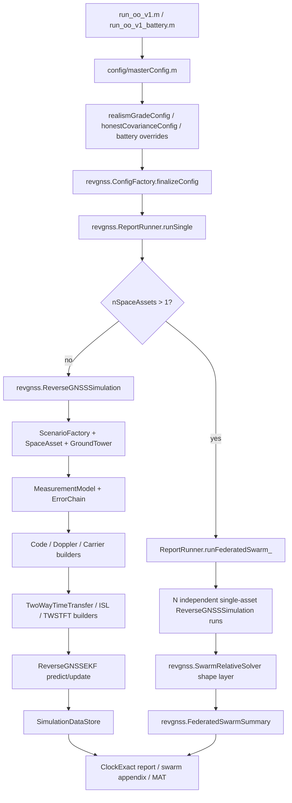

Main single-asset runtime:

1. `run_oo_v1.m` or `run_oo_v1_battery.m` builds a config.
2. `revgnss.ConfigFactory.finalizeConfig` resolves profiles, observability guards, atmosphere profile, gauge choices, and double-count guards.
3. `revgnss.ReportRunner.runSingle` dispatches either to `ReverseGNSSSimulation` or to the federated swarm wrapper.
4. `ReverseGNSSSimulation.run` advances truth, predicts the EKF, builds measurement rows, appends optional ISL/TW rows, updates the EKF, computes diagnostics, and records into `SimulationDataStore`.
5. Report builders read the stored data and produce MAT/PDF outputs.

Main swarm runtime:

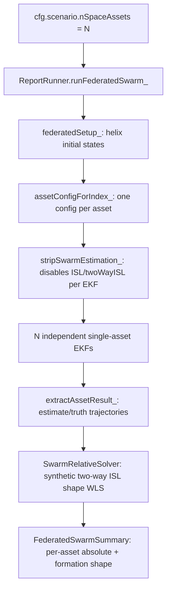

This is scientifically better than the old primary-centric joint EKF because no shared covariance can contaminate every asset. The cost is interpretational: the relative layer is not an absolute navigation update and does not feed back into the per-asset filters.

## 3. Measurement and EKF Spine

Core pseudorange model in `MeasurementModel`:

```text
z_i = rho_ant,true_i + b_rx,true - b_tower,true_i + error_truth_i
h_i = rho_ant,est_i  + b_rx,est  - b_tower,model_i + error_model_i
```

This sign convention is internally consistent for an uplink tower transmitting to a receiver in space. The EKF update uses innovation `z - h`, a linearized H, full R, right-division Kalman gain, and Joseph covariance update. NIS and NEES are computed from the stored innovation/statistics. Quaternion/attitude state handling is reset after update, which is the right pattern for small-angle attitude corrections.

The estimator is statistically disciplined in its central update. The main risks are not the Kalman algebra; they are whether each physical error is injected once, assigned the right covariance/correlation, and represented consistently after multi-frequency expansion.

## 4. Error Source Audit

### 4.1 Code Thermal Noise and C/N0 Weighting

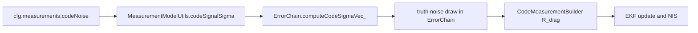

Formula:

```text
epsilon_code ~ N(0, sigma_code(el, C/N0, signal)^2)
R_code = sigma_code^2
```

Verdict: scientifically sound in structure. The code supports constant/elevation/C/N0 weighting and signal-specific L1/L2 sigma. In realism grade, C/N0 weighting prevents low-elevation rows from being over-trusted. For the current battery, code noise is not isolated because the default profile also includes atmosphere and the battery explicitly enables several toggles.

### 4.2 Receiver Clock Truth and EKF Clock Process Noise

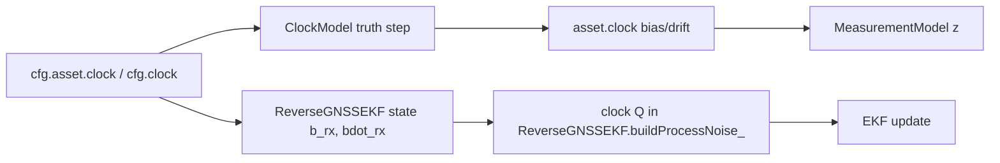

Formula family:

```text
b_{k+1} = b_k + dt * bdot_k + noise
bdot_{k+1} = bdot_k + noise
Q_clock uses Brown-Hwang style bias/drift integration
```

Verdict: correct for a compact clock-state EKF. The code honestly documents that a two-state EKF cannot fully represent every power-law clock component. This is acceptable if claims are limited to simulation scenarios using the configured stochastic clock, not a full clock-metrology model.

### 4.3 Tower Clock Truth, Broadcast Product, and Product Covariance

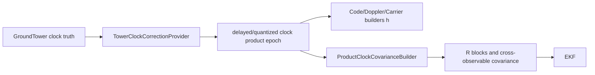

Formula:

```text
b_tower,model(t) = b_product(t_p) + bdot_product(t_p) * (t - t_p)
sigma_product^2 = sigma_bias^2 + age^2 * sigma_drift^2
```

Verdict: good. The code has explicit guards to avoid charging tower-product clock sigma when equivalent tower clock states are already estimated. Product covariance logic distinguishes code, Doppler, and carrier, including the special carrier ambiguity absorption case. The realism-grade increase from near-final to RTS-like product sigma is scientifically justifiable.

### 4.4 Troposphere and ZWD States

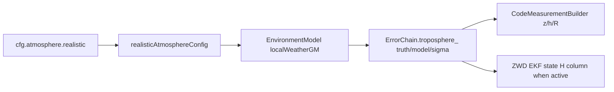

Formula:

```text
T_slant = m_h(el) * ZHD + m_w(el) * ZWD
ZWD follows first-order Gauss-Markov when enabled
phi = exp(-dt/tau)
q = sigma_ss^2 * (1 - phi^2)
```

Verdict: structurally correct. The Saastamoinen/Davis hydrostatic plus GM wet delay approach is reasonable for a thesis-grade simulation. A useful double-count guard is present: when per-tower ZWD states are active, R charges only the fast residual rather than the full state-estimated wet delay. Limitation: no horizontal gradients or VMF/GPT product ingestion, so do not make real geodetic-grade troposphere claims.

### 4.5 First-Order Ionosphere

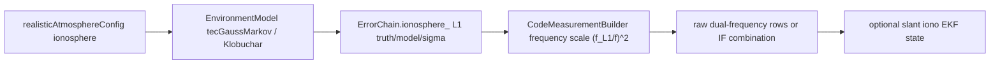

Formula:

```text
I_f = I_L1 * (f_L1 / f)^2
code: +I_f
carrier phase: -I_f
```

Verdict: mostly correct. The sign convention between code and carrier is correct. The IF combination correctly recognizes that first-order ionosphere cancels if the same physical TEC drives both L1 and L2. The slant ionosphere state uses the correct positive code derivative and the negative carrier derivative.

### 4.6 Higher-Order Ionosphere

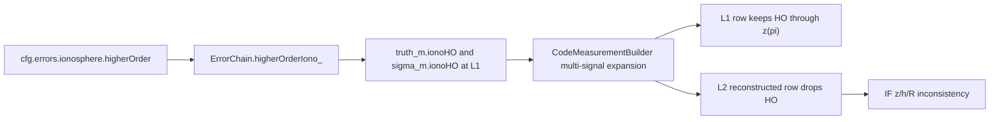

Formula intended:

```text
I_HO,L1 = bounded residual from first-order L1 slant delay
I_HO,f approximately I_HO,L1 * (f_L1/f)^3 plus smaller f^-4 terms
IF gain approximately alpha + beta * (f_L1/f_L2)^3
```

Verdict: not currently correct in the active multi-frequency code path. `ErrorChain` creates `truth_m.ionoHO`, includes it in `truthTotal_m`, and adds its sigma. But `CodeMeasurementBuilder` uses `flds = {'code','trop','iono','hwDelay','mp','scintillation'}` during multi-signal expansion, omitting `ionoHO`. L1 keeps the original HO by using `z(pi)`, but L2 is reconstructed from geometry + trop + first-order iono + hardware + multipath + code + scintillation, with no HO term. R can still include the HO sigma through `sigmaExtra_m`, and IF variance comments assume an HO survival gain. Therefore z/h/R and diagnostics do not describe the same physics. This is the clearest scientific implementation defect found.

Required fix: carry `ionoHO` through multi-signal expansion with proper frequency scaling, include it in `truthTotal_m`/diagnostics, and add an integration test that observes L2 and IF code rows, not only `ErrorChain` and `HigherOrderIonosphere` in isolation.

Secondary diagnostic fix: add `ionoHO` to stored per-source RMS/report fields. `SimulationDataStore` currently persists code/trop/iono/hardware/multipath per-source RMS, but not higher-order ionosphere, so the report can remain incomplete even after the row-level physics is corrected.

### 4.7 Ionospheric Scintillation

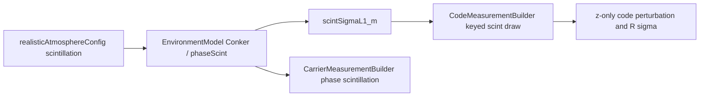

Formula:

```text
epsilon_scint,f ~ N(0, sigma_scint,L1^2 * (f_L1/f)^(2p))
```

Verdict: reasonable for stochastic measurement realism. Scintillation is z-only with covariance support and frequency scaling. It is not a full ionospheric phase-screen propagation model, but that is acceptable if labelled as stochastic scintillation.

### 4.8 Multipath

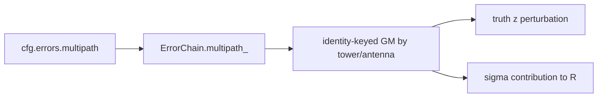

Formula:

```text
x_{k+1} = exp(-dt/tau) x_k + w_k
sigma_mp(el) = sigma_ss / sin(el)^p
```

Verdict: scientifically plausible as a compact code multipath model. The biggest statistical caveat is temporal correlation. If R is treated as white each epoch, long runs can become over-confident even with correct per-epoch NIS. The code comments in `honestCovarianceConfig` correctly diagnose this as an observability/correlation problem rather than a scalar R problem.

### 4.9 Hardware Delay, DCB, and Inter-Frequency Biases

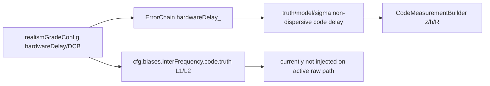

Formula intended:

```text
code delay = common hardware delay + signal-dependent DCB_f
IF residual = alpha * DCB_L1 + beta * DCB_L2
```

Verdict: hardware delay is implemented as a non-dispersive stochastic residual and is not double-counted with DCB. DCB values exist in realism config, but the active raw dual-frequency pseudorange path does not inject them into z/h. This is documented elsewhere in the repo and should remain a stated limitation. Do not count hardware delay and DCB as independent full-magnitude frequency-dependent effects unless the implementation is explicitly split into common and differential components.

### 4.10 Tower Survey, EOP, Solid Earth Tide, PCO, and PCV

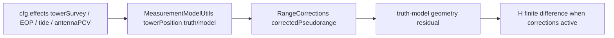

Formula:

```text
rho = ||r_rx,ant - r_tx,ant||
PCV_model approx amp * cos(el)^2 or table interpolation
tower survey residual = ENU error transformed to ECEF
```

Verdict: directionally correct. The code applies station/tower geometry perturbations as truth/model range changes and uses finite-difference H when the correction path is active. PCV is a compact model, not ANTEX-grade. EOP/tide are truth-side residuals under realism and should not be described as real-time IERS processing.

### 4.11 Sagnac, Light-Time, Shapiro, and Relativistic Clock

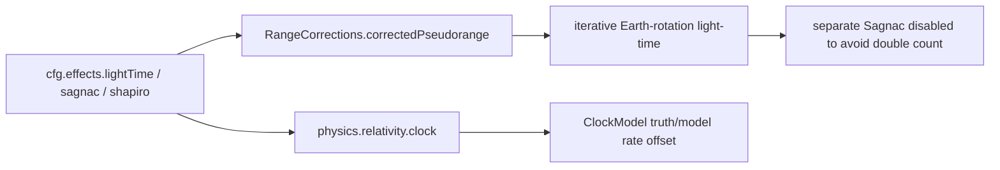

Formulas:

```text
Sagnac approx (omega_E/c) * (x_tx*y_rx - y_tx*x_rx)
Shapiro = 2*mu/c^2 * log((r_rx + r_tx + R)/(r_rx + r_tx - R))
```

Verdict: good for this level of simulation. The ConfigFactory guard that disables separate Sagnac when iterative one-way light-time is used is exactly the right anti-double-count pattern.

### 4.12 Doppler / Range Rate

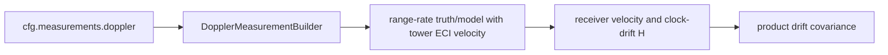

Formula:

```text
z_dop = dot(u, v_rx - v_tx) + bdot_rx - bdot_tower + noise
```

Verdict: mostly correct. The code includes tower motion and product-drift covariance. The position partial is intentionally optional/limited for the primary GEO case; that is a documented approximation. For high dynamics or wall-limited secondary states, the codebase already notes that Doppler position partials become important.

### 4.13 Carrier Phase, Ambiguity, Slips, and Differential Attitude

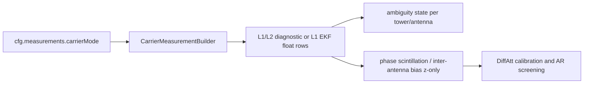

Formula:

```text
phi = rho + b_rx - b_tower + trop - iono + lambda*N + phase errors
```

Verdict: scientifically coherent for float carrier. Sign of ionosphere is correct. The code is honest that absolute carrier hardware phase bias is absorbed by float ambiguities and that formal integer LAMBDA fixing is not implemented. Differential attitude can be valid as a short-baseline/relative carrier feature, but it should not be sold as calibrated absolute carrier phase navigation.

### 4.14 Orbit Truth, EKF Dynamics, and Process Noise

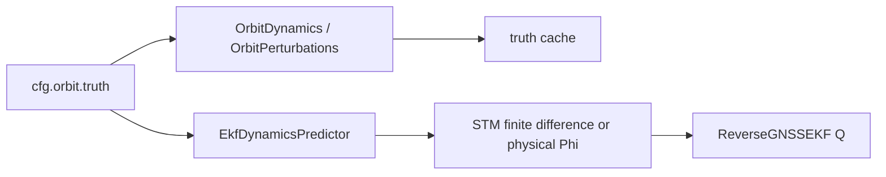

Formula family:

```text
a = -mu*r/r^3 + J2 + optional third-body + optional SRP
Q_accel uses continuous white acceleration integration into r/v
```

Verdict: appropriate for a controlled simulation. J2, RK4, low-precision third body, and cannonball SRP are adequate for the stated architecture studies. They are not a replacement for precise orbit determination force models. Realism grade correctly closes the large deterministic force gap by enabling matched truth and EKF perturbations while leaving residual SNC for unmodelled acceleration.

### 4.15 Ground Tower-Spacecraft Two-Way Time Transfer

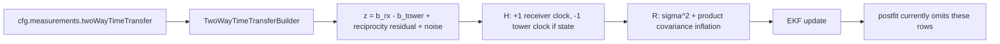

Formula:

```text
Delta_i = b_rx - b_tower_i + epsilon_TW
H_position = 0
```

Verdict: the measurement model is scientifically strong and directly addresses the GEO radial-clock degeneracy. The conservative product-correlation inflation is the right statistical idea because tower product errors are interval-correlated. The defect is diagnostic: postfit residual computation does not append/predict these rows, so reports can omit the exact rows that made TW valuable.

### 4.16 One-Way ISL, Two-Way ISL, and Federated Shape

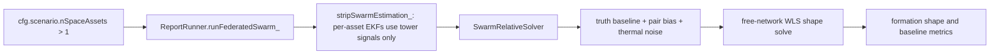

Formula:

```text
z_ik = ||r_i,true - r_k,true|| + b_pair + epsilon_ik
residual = z_ik - ||r_i,est - r_k,est||
H_i = +u_ik^T, H_k = -u_ik^T
```

Verdict: the free-network WLS shape formulation is scientifically correct for relative shape only. It correctly cannot observe absolute translation or rotation and it uses gauge-invariant metrics. The problem is the gate: the shape layer always creates these observations for N>1, even when `multiAsset.twoWayISL.enable=false`. Therefore the current swarm MAT/PDF results are not "what reverse-GNSS alone estimates for a swarm"; they are "independent reverse-GNSS absolute estimates plus an assumed truth-synthesized two-way ISL shape measurement layer".

### 4.17 Relative Clock TWSTFT Between Space Assets

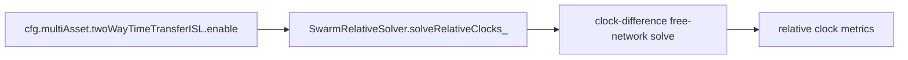

Formula:

```text
Delta_ik = b_i - b_k + epsilon_ik
```

Verdict: unlike shape, the relative-clock enhancement is explicitly gated and default-off. When enabled, it is correctly described as a relative-clock layer, not an absolute clock fix.

### 4.18 Covariance, Correlation, NIS, and NEES

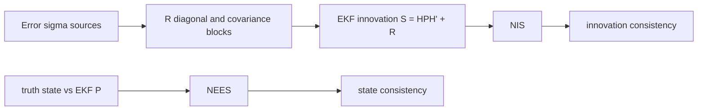

Verdict: the EKF statistics are implemented with the right mathematical objects. The important scientific lesson is that NIS can look reasonable while NEES is very poor if the truth contains temporally correlated per-tower systematics that the filter treats as white. This is already diagnosed in `honestCovarianceConfig`: scalar R inflation is not an honest cure for the one-way sparse GEO observability wall. Geometry changes, especially ground-space TW transfer and physically modelled co-observed swarm links, are the honest path.

## 5. Cross-Cutting Double-Count Checks

| Effect | Double-count status |
| --- | --- |
| Sagnac vs iterative light-time | Good guard: separate Sagnac disabled when iterative one-way light-time includes Earth rotation. |
| Tower clock product vs tower clock states | Good guard: product sigma is masked/avoided when tower clock states would represent the same uncertainty. |
| Troposphere/ZWD state vs R | Good guard: state-estimated ZWD avoids charging the full slow residual in R. |
| Ionosphere slant state vs R | Good guard exists for state-estimated slant ionosphere, but multi-signal HO handling is defective. |
| Hardware delay vs DCB | No double-count today because DCB is inert and hardware delay is non-dispersive. Scientific gap remains for real per-signal DCB. |
| Carrier hardware phase bias vs ambiguity | Correctly disclosed as absorbed into float ambiguities. |
| Swarm absolute vs relative | No covariance double-count in the estimator because relative layer is read-only. Interpretation issue remains because synthetic ISL observations are created unconditionally for N>1. |

## 6. Battery Run Analysis

The Claude-run battery command completed both 8-case blocks successfully:

```text
Battery_idealised: run_oo_v1_battery(... Realism=false ...)
Battery_realism:   run_oo_v1_battery(... Realism=true  ...)
```

The single-asset cases below were read from their saved MAT summaries. Note the summary field `finalPositionRMS_m` is the final 20 epochs, while the console's "last 20%" line is a larger tail window. The table below uses MAT fields for repeatability.

| Group | Case | Final pos (m) | Pos RMS final 20 ep (m) | Pos RMS runwide (m) | Clock RMS final 20 ep (m) | Clock RMS runwide (m) | Mean NIS / expected |
| --- | --- | ---: | ---: | ---: | ---: | ---: | ---: |
| Battery_idealised | G5S1R1_TW0 | 4.505 | 4.516 | 14.795 | 1.424 | 13.758 | 22.85 / 25 |
| Battery_idealised | G5S1R1_TW1 | 5.382 | 5.385 | 6.162 | 0.0006 | 0.0032 | 24.01 / 30 |
| Battery_idealised | G5S1R4_TW0 | 5.886 | 5.829 | 16.316 | 1.904 | 15.114 | 90.74 / 100 |
| Battery_idealised | G5S1R4_TW1 | 5.049 | 5.042 | 5.901 | 0.0005 | 0.0032 | 91.90 / 105 |

Completed `Battery_realism` single-asset cases:

| Group | Case | Final pos (m) | Pos RMS final 20 ep (m) | Pos RMS runwide (m) | Clock RMS final 20 ep (m) | Clock RMS runwide (m) | Mean NIS / expected |
| --- | --- | ---: | ---: | ---: | ---: | ---: | ---: |
| Battery_realism | G5S1R1_TW0 | 9.707 | 9.470 | 35.156 | 3.629 | 33.467 | 29.26 / 22.36 |
| Battery_realism | G5S1R1_TW1 | 9.485 | 9.494 | 10.824 | 0.152 | 0.147 | 30.05 / 27.74 |
| Battery_realism | G5S1R4_TW0 | 10.980 | 10.876 | 42.151 | 4.406 | 40.631 | 97.31 / 91.84 |
| Battery_realism | G5S1R4_TW1 | 9.989 | 9.973 | 11.377 | 0.058 | 0.100 | 98.11 / 97.26 |

Interpretation of the completed single-asset cases:

1. Ground-space TW time transfer strongly constrains receiver clock: runwide clock RMS drops from 13-15 m to about 0.003 m in both R1 and R4.
2. Position benefits mostly in the runwide metric: R1 improves from 14.8 m to 6.2 m and R4 from 16.3 m to 5.9 m. The final-epoch position can still be similar or slightly worse because geometry, atmosphere/systematics, and convergence transients remain.
3. R4 does not automatically improve the absolute position over R1 in this baseline block. The extra receivers primarily exercise carrier attitude/differential baseline machinery and add rows; they do not remove the fundamental tower-geometry/radial-clock wall by themselves.
4. NIS remains below or near expected in these cases. That is innovation consistency, not proof of state consistency. NEES/coverage still needs a dedicated extraction or analysis run.
5. The realism rows confirm the observability warning more strongly: without TW, runwide clock RMS grows to 33-41 m and runwide position RMS to 35-42 m. With TW, clock RMS drops to 0.10-0.15 m and runwide position RMS to about 10.8-11.4 m, but final/tail position remains around 9.5-10.0 m. TW fixes the clock lever; it does not create missing geometric diversity.

Both `Battery_idealised` and `Battery_realism` finished 8/8 cases with `OK` in their battery logs.

Completed swarm rows:

| Group | Case | Abs err per asset tail RMS (m) | Clock err per asset tail RMS (m) | Raw shape RMS (m) | Solved shape RMS (m) | Solved baseline RMS (m) | Relative clock |
| --- | --- | --- | --- | ---: | ---: | ---: | --- |
| Battery_idealised | G5S3R4_TW0 | [6.243, 5.192, 3.452] | [2.169, 3.005, 1.578] | 2.953 | 0.0169 | 0.0126 | off |
| Battery_idealised | G5S3R4_TW1 | [5.365, 3.796, 1.411] | [0.0032, 0.0033, 0.0037] | 2.886 | 0.0169 | 0.0126 | off |
| Battery_idealised | G5S6R4_TW0 | [6.243, 5.192, 3.452, 2.418, 7.008, 4.525] | [2.169, 3.005, 1.578, 0.405, 1.234, 0.918] | 3.929 | 0.0423 | 0.0131 | off |
| Battery_idealised | G5S6R4_TW1 | [5.365, 3.796, 1.412, 2.317, 8.138, 5.000] | [0.0032, 0.0033, 0.0037, 0.0036, 0.0033, 0.0037] | 3.141 | 0.0423 | 0.0131 | off |
| Battery_realism | G5S3R4_TW0 | [11.691, 8.013, 8.566] | [4.804, 5.512, 2.160] | 1.677 | 0.0169 | 0.0126 | off |
| Battery_realism | G5S3R4_TW1 | [10.678, 7.113, 7.800] | [0.0895, 0.0970, 0.0826] | 2.403 | 0.0169 | 0.0126 | off |
| Battery_realism | G5S6R4_TW0 | [11.691, 8.013, 8.567, 6.512, 11.500, 7.679] | [4.804, 5.512, 2.165, 1.905, 4.469, 2.308] | 4.054 | 0.0423 | 0.0131 | off |
| Battery_realism | G5S6R4_TW1 | [10.678, 7.113, 7.799, 6.568, 12.340, 8.988] | [0.0895, 0.0970, 0.0825, 0.0863, 0.0985, 0.0833] | 2.559 | 0.0423 | 0.0131 | off |

Interpretation of the completed swarm rows:

1. The per-asset absolute errors remain metre-level because each asset is still estimated by its own tower-based EKF.
2. The relative layer sharply improves internal formation shape: raw shape RMS 2.95 m becomes 1.69 cm, and baseline RMS becomes 1.26 cm.
3. `relClockGateOn=false`, so no sat-sat relative-clock conclusion should be drawn from this row.
4. `everWeaklyObservable=true` but tail `weaklyObservable=false`; this means the formation passed through an early weak geometry but the reported tail window was not weak.
5. Ground-space TW reduces per-asset clock error to millimetres in the TW1 row and also improves absolute tail position for this S3 case, but the solved relative-shape metric is almost unchanged because it is dominated by the synthetic ISL range layer.
6. The first six-asset row has `everWeaklyObservable=false`, which is better than the three-asset run. Its solved shape RMS is still centimetre-class but rises to 4.23 cm, while the baseline RMS remains about 1.31 cm.
7. The six-asset TW1 row shows the same solved shape and baseline RMS as TW0 to displayed precision. This supports the implementation reading: ground-space TW affects per-asset absolute clock/radial behaviour, while the solved formation shape is set by the independent synthetic ISL range layer.
8. The first realism swarm rows have worse absolute errors than the idealised counterparts, but the solved shape remains 1.69 cm because the same synthetic ISL range layer dominates the formation-shape metric.
9. Realism `G5S3R4_TW1` again shows ground-space TW controlling the per-asset clocks below 0.1 m without materially changing the solved relative shape. The absolute position error remains 7-11 m and formal absolute sigmas are much too optimistic, so this is still not an honest high-accuracy absolute swarm estimate.
10. Realism `G5S6R4_TW0` has `everWeaklyObservable=false`, matching the idealised six-asset case. The six-asset constellation is therefore better conditioned for shape than the three-asset constellation, but the noise-limited solved shape RMS is still about 4.23 cm rather than 1.69 cm.
11. Realism `G5S6R4_TW1` again pulls all per-asset clock errors below 0.1 m while leaving solved formation shape and baseline RMS unchanged to displayed precision.
12. Because the shape layer synthesizes two-way ISL observables from truth for N>1, the centimetre-class result is an assumed two-way-ISL relative-layer result, not a pure reverse-GNSS-only swarm result.

Runtime forensic note for the `G5S3R4` pair:

| Case | Battery wall time | Visible per-run simulation times | Visible simulation subtotal | Non-simulation/report overhead |
| --- | ---: | --- | ---: | ---: |
| G5S3R4_TW0 | 2321 s | 9:07, 10:08, 8:43, 8:44 | 2202 s | about 119 s |
| G5S3R4_TW1 | 1586 s | 7:06, 6:07, 6:08, 6:10 | 1531 s | about 55 s |

Preliminary conclusion: the shorter TW1 runtime is not explained by the measurement model having less work. TW1 adds five clock-only EKF rows per epoch, and in the single-asset `G5S1R4` pair it is slightly slower, not faster. The `G5S3R4_TW0` case is the first federated swarm case in the battery and shows slow early per-epoch rates that ramp upward, while the following swarm cases run much faster. The most likely explanation is MATLAB/JIT/class-path/renderer warm-up plus normal machine-load variability, with a secondary possible contribution from TW-improved numerical conditioning. A defensible proof would rerun `G5S3R4_TW1` before `TW0`, preferably with `WritePdf=false`, and compare MAT-only per-asset timing.

Important interpretation notes from the full battery log:

1. `Battery_idealised` is not zero-error/oracle. Because `run_oo_v1_battery` defaults `Atmosphere='realistic'` and the user command did not override it, the baseline battery still inherits the realistic atmosphere profile unless explicitly set to `Atmosphere='matched'`.
2. Single-asset two-way time transfer improves the clock/radial observability physics, but current postfit diagnostics omit the appended TW rows.
3. Multi-antenna single-asset runs have larger measurement counts and attitude/differential-carrier machinery. The DataStore tower count printed by the log is inflated by row expansion and should not be read as the physical tower count.
4. Multi-asset swarm runs will include the federated relative layer and should be interpreted as absolute per-asset tower-based EKFs plus an assumed two-way ISL shape solve.

## 7. Swarm Possibility Assessment

The current architecture can support a scientifically credible swarm story, but only with precise claims:

1. Per-asset absolute position remains limited by the same reverse-GNSS geometry each asset sees. A swarm does not magically remove common-mode tower clock, atmosphere, survey, or radial-clock degeneracy unless those modes are made observable by additional links or diverse geometry.
2. The federated design is the right estimator architecture for now. N independent EKFs avoid the previous shared-covariance failure mode, allow independent receiver-noise seeds, and keep each asset's absolute error honest.
3. The relative layer can give strong formation-shape accuracy if real two-way ISL ranges exist. The WLS formulation is appropriate for shape because two-way range observes internal distances, not absolute translation/rotation.
4. The current implementation must be labelled as an assumed relative-layer result, because it synthesizes two-way ISL observations from truth even when the config gate is off.
5. Relative clock can be credible only when sat-sat TWSTFT is explicitly enabled. That path is gated, and the report correctly says it is off otherwise.
6. For N=3, formation geometry can be weakly observable in out-of-plane bending. N=4 or more with nonzero cross-track spread is the safer minimum for 3D swarm shape claims. The `crossTrackSpread=1.0` safeguard in the federated setup is scientifically important.
7. Ground tower-spacecraft two-way time transfer is the most direct route to breaking the single-asset GEO clock/radial wall. Swarm relative links sharpen formation shape, but they do not by themselves anchor the formation absolutely.

Bottom line: the best defensible mission concept is a layered one:

```text
absolute state per asset  = tower reverse-GNSS EKF, optionally helped by ground-space TW transfer
relative formation shape  = physically enabled two-way ISL range layer
relative clock            = explicitly enabled sat-sat TWSTFT layer
absolute common-mode      = still requires ground geometry, two-way clock links, external products, or another absolute anchor
```

## 8. Required Fixes Before Strong Scientific Claims

1. Fix higher-order ionosphere propagation through multi-signal code rows and IF combination, then add a full measurement-builder test.
2. Gate `SwarmRelativeSolver` shape observations on `cfg.multiAsset.twoWayISL.enable`, or rename/report the current layer as always-on synthetic truth-sampled relative ranging.
3. Add `TwoWayTimeTransferBuilder.predictEkfRows` or equivalent and append its rows in `computePostfitResiduals_`.
4. Fix `SimulationDataStore` tower-clock storage so physical tower count is not overwritten by expanded row count.
5. Either implement real per-signal DCB injection on the active raw path or remove/soften realism-grade wording that implies DCB is active.
6. Clarify battery labels: "default/non-realism-grade" vs "realism-grade"; reserve "idealised" for matched/no-atmosphere/no-systematics cases.
7. Add a validation ladder that reports NIS, NEES, position RMS, clock RMS, postfit completeness, and relative-shape metrics separately.
8. Remove or update stale ISL comments/stubs so code documentation matches the current federated implementation.

## 9. Verification Status

Static audit completed against current code paths:

- `run_oo_v1.m`
- `run_oo_v1_battery.m`
- `config/masterConfig.m`
- `config/realismGradeConfig.m`
- `config/honestCovarianceConfig.m`
- `+revgnss/ConfigFactory.m`
- `+revgnss/ReportRunner.m`
- `+revgnss/ReverseGNSSSimulation.m`
- `+revgnss/SwarmRelativeSolver.m`
- `+revgnss/FederatedSwarmSummary.m`
- `+data/SimulationDataStore.m`
- `+models/+measurements/MeasurementModel.m`
- `+models/+measurements/CodeMeasurementBuilder.m`
- `+models/+measurements/DopplerMeasurementBuilder.m`
- `+models/+measurements/CarrierMeasurementBuilder.m`
- `+models/+errors/ErrorChain.m`
- `+models/+errors/EnvironmentModel.m`
- `+models/+corrections/RangeCorrections.m`
- `+filter/ReverseGNSSEKF.m`
- `+filter/EkfDynamicsPredictor.m`
- `+models/+orbit/OrbitDynamics.m`
- `+models/+orbit/OrbitPerturbations.m`

Runtime battery validation completed:

- `output/Report_20260721/Battery_idealised/battery_log.txt`: 8/8 `OK`.
- `output/Report_20260722/Battery_realism/battery_log.txt`: 8/8 `OK`.
- `output/Report_20260722/Battery_realism/battery_manifest.mat` was written.
- MATLAB process exited after the final realism case.
